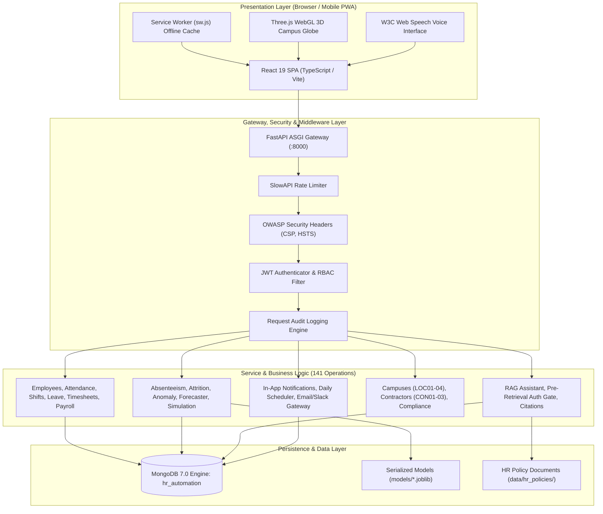

# AI-Powered Workforce Management Automation System (InnovateCorp HRvantage)

[](file:///docs/RELEASE_NOTES.md)
[](file:///docs/FINAL_REGRESSION_REPORT.md)
[](file:///docs/FINAL_REGRESSION_REPORT.md)
[](file:///docs/FINAL_DATA_VALIDATION_REPORT.md)
[](file:///docs/FINAL_API_INVENTORY.md)
[](file:///docs/FINAL_SECURITY_CHECKLIST.md)

**InnovateCorp HRvantage** is an enterprise-grade, full-stack Workforce Management (WFM) and Human Resource Automation platform. Engineered for mid-to-large multi-campus organizations, it bridges core operational administration—such as GPS-geofenced attendance, rotational shift scheduling, multi-tier leave workflows, project timesheets, and attendance-synchronized payroll—with predictive machine learning intelligence, a grounded Retrieval-Augmented Generation (RAG) HR Policy Assistant, real-time event notifications, and an ambient 3D WebGL user interface.

---

## 1. Executive Overview

### The Problem
Traditional enterprise HR platforms are siloed, reactive, and friction-heavy:
- **Operational Silos:** Attendance, timesheets, shift allocations, and payroll operate in disconnected databases, creating error-prone month-end reconciliation bottlenecks.
- **Attendance Vulnerabilities:** Physical turnstiles suffer from buddy-punching, while mobile check-in apps lack tamper-proof geospatial boundary validation.
- **Reactive Management:** HR departments only discover employee burnout and attrition after an exit notice is served, leading to unexpected project staffing shortages.
- **Information Inaccessibility:** Employees spend excessive time searching static 100-page policy PDFs for basic questions regarding leave entitlements or travel guidelines.

### The Solution
InnovateCorp HRvantage unifies workforce administration into a single, cohesive, and intelligent platform:
- **Operational Core:** Geofenced GPS attendance across multi-campus facilities, automated shift allocation, peer shift swaps, multi-tier leave approval, billable timesheets, and attendance-synchronized payroll.
- **Workforce Intelligence:** Machine learning models that forecast absenteeism risk, identify churn drivers, detect abnormal punch behaviors (Isolation Forest), and forecast 30-day departmental demand.
- **Grounded Conversational RAG Assistant:** An AI assistant that answers HR policy queries with exact citations and enforces security *before* querying sensitive records.
- **Statutory Rule Engine:** Automated compliance monitoring that flags overtime and rest-period violations in real time.

### Target User Personas
1. **Employees:** Mobile self-service clock-in/out, shift calendar, leave requests, timesheets, digital payslips, and 24/7 conversational policy assistance.
2. **Managers:** Real-time team presence telemetry, consolidated approval queues for leaves and shift swaps, and project utilization dashboards.
3. **HR Professionals:** Organization-wide workforce demographics, predictive attrition risk scores, monthly payroll execution batches, and labor compliance monitoring.
4. **Administrators:** Role-Based Access Control governance, integration connector health monitoring, and system audit trail inspection.

---

## 2. Key Features

```
├── Operational HR Management
│   ├── Exact 200 Regular Employees (EMP001–EMP200) with complete manager hierarchy
│   ├── Contractor & Vendor Management (CON001–CON003) with hourly rate card billing
│   ├── Multi-Campus Geofenced Attendance (Hyderabad, Bengaluru, Pune, Noida)
│   ├── Rotational Shift Allocation, Fatigue Prevention & Peer Shift Swaps
│   ├── Leave Management with automatic quota deductions & holiday calendar
│   ├── Weekly Timesheets with billable vs non-billable client milestone tracking
│   └── Automated Gross-to-Net Payroll with attendance sync, overtime, tax, PF, & payslips
│
├── Predictive AI & Workforce Intelligence
│   ├── Supervised Absenteeism Risk Classifier (Random Forest, 72.0% accuracy)
│   ├── Supervised Attrition Risk Model (Gradient Boosting, 98.0% accuracy, 0.968 ROC-AUC)
│   ├── Unsupervised Attendance Anomaly Detection (Isolation Forest, 3.0% contamination)
│   ├── 30-Day Departmental Demand Forecaster (Holt-Winters Exponential Smoothing)
│   ├── Objective Composite Productivity Scoring (Attendance + Billability + OKRs)
│   ├── Explainable Skills Gap Analysis & Training Course Matching
│   └── Deterministic Workforce Scenario Sensitivity Simulation
│
├── Grounded Conversational RAG Assistant
│   ├── Natural Language & Voice Interaction via W3C Web Speech API
│   ├── Semantic Vector Search over Official HR Policies with Cosine Similarity
│   ├── Verifiable Policy Section Citations & Hallucination Suppression
│   ├── Pre-Retrieval Authorization Gate (Blocks unauthorized salary/PII queries with HTTP 403)
│   └── Adversarial Guardrails (Prompt injection defense & PII redaction)
│
├── Security, Governance & Observability
│   ├── 4-Tier Role-Based Access Control (ADMIN, HR, MANAGER, EMPLOYEE)
│   ├── Stateless HMAC-SHA256 JWT Authentication & Passlib Bcrypt Hashing (Cost 12)
│   ├── OWASP Security Headers (HSTS, CSP, X-Frame-Options: DENY, nosniff)
│   ├── SlowAPI Rate Limiting on Authentication & AI Endpoints
│   ├── Request Audit Trail Logging with Unique Alphanumeric log_id Indexing
│   └── Real-time Statutory Labor Compliance Monitoring (Overtime & Rest Limits)
│
└── Modern Enterprise UI / UX & PWA
    ├── React 19 SPA with TypeScript, Vite, & Curated Vanilla CSS Design Tokens
    ├── Progressive Web App (PWA) with Service Worker Asset Caching & Offline Detection
    └── Three.js WebGL Interactive 3D Campus Globe with 2D Canvas Fallback
```

---

## 3. System Architecture



---

## 4. Technology Stack Specification

| Category | Technology | Version | Purpose in Platform |
| :--- | :--- | :--- | :--- |
| **Frontend Framework** | React | 19.x | Component-based Single Page Application |
| **Frontend Language** | TypeScript | 5.8.x | Strict end-to-end type safety |
| **Frontend Build Tool**| Vite | 8.3.x | Sub-second HMR & optimized production bundling |
| **Styling & Icons** | Vanilla CSS, Lucide React | Curated | Custom enterprise design tokens, zero utility bloat |
| **3D Rendering** | Three.js | 0.186.x | Interactive WebGL globe with 2D canvas fallback |
| **Mobile & PWA** | Service Worker, Web Manifest | W3C Standard | Offline asset caching & mobile installability |
| **Backend Framework** | FastAPI | 0.115.x | High-throughput asynchronous ASGI REST server |
| **Backend Runtime** | Python | 3.12+ | Asynchronous core runtime |
| **Database Engine** | MongoDB Community | 7.0.x | Primary document database with compound indexes |
| **Relational Staging** | SQLite3 | Built-in | Relational schema staging & integrity validation |
| **Machine Learning** | Scikit-learn, Statsmodels | 1.5.x / 0.14.x | Supervised classifiers, Isolation Forest, Holt-Winters |
| **Serialization** | Joblib | 1.4.x | In-memory pre-trained model artifact loading |
| **Authentication** | PyJWT, Passlib (Bcrypt) | 2.9.x / 1.7.x | HMAC-SHA256 JWT tokens & salted password hashing |
| **Rate Limiting** | SlowAPI | 0.1.9 | In-memory leaky-bucket request throttling |
| **Containerization** | Docker, Docker Compose | Multi-stage | Isolated production microservice deployment |
| **Testing Harness** | Pytest, Vitest | 8.x / 5.x | 166 automated unit, integration, & component tests |

---

## 5. Project Directory Structure

```
HR_Automation/
├── ai/                         # Machine learning models, feature pipelines, training
│   ├── data/                   # Data extractors
│   ├── features/               # 30-day temporal rolling feature builders
│   ├── models/                 # Absenteeism, attrition, anomaly, forecaster, rules
│   └── training/               # Model training script (train_all.py)
├── backend/                    # FastAPI ASGI application core
│   ├── ai/chatbot/             # RAG chatbot: guardrails, auth gate, retriever, citations
│   ├── middleware/             # Rate limiters, OWASP security headers, audit logging
│   ├── models/                 # PyMongo data models
│   ├── routers/                # 17 modular REST API routers
│   ├── schemas/                # Pydantic v2 input/output validation schemas
│   ├── services/               # Notification engine, scheduler, integrations
│   ├── utils/                  # Geofence calculator (Haversine), JWT token helpers
│   └── main.py                 # ASGI entrypoint with lifespan manager
├── database/                   # MongoDB connection pool, indexes, seeding pipeline
│   ├── mongodb.py              # PyMongo client & index creation
│   ├── seed_database.py        # Bulk insertion pipeline
│   └── schema.sql              # Relational reference schema
├── data/                       # Synthetic datasets, fixtures, policies
│   ├── fixtures/               # Seed JSON documents
│   └── hr_policies/            # Corporate policies for RAG semantic search
├── docs/                       # Comprehensive documentation suite
│   ├── diagrams/               # 10 Mermaid architectural diagrams
│   ├── FINAL_API_INVENTORY.md  # All 141 production REST operations cataloged
│   ├── FINAL_AI_MODEL_CATALOG.md # ML specifications, metrics, explainability
│   ├── FINAL_DEMO_SCRIPT.md    # 8-10 minute live presentation runbook
│   ├── INTERNSHIP_PRESENTATION.md # 18-slide academic defense presentation deck
│   └── VIVA_INTERVIEW_PREPARATION.md # Comprehensive technical defense Q&A
├── frontend/                   # React 19 + TypeScript + Vite frontend
│   ├── src/
│   │   ├── __tests__/          # Vitest component, RBAC, PWA, and auth tests
│   │   ├── components/         # Shared UI components, 3D Canvas, Modal, Nav
│   │   ├── pages/              # Views for ESS, Manager, HR, Chatbot, Shifts, etc.
│   │   └── services/           # Axios REST API client & auth state
│   └── public/                 # Web App Manifest & Service Worker (sw.js)
├── models/                     # Serialized production model artifacts (.joblib)
├── scripts/                    # Operational automation & validation scripts
│   ├── reset_demo_environment.py # One-command demo environment reset utility
│   ├── validate_database.py    # Automated 32-check relational integrity suite
│   └── backup_database.py      # Database backup & snapshot utility
├── tests/                      # Pytest backend integration & security test suites
├── Dockerfile                  # Multi-stage production container build
├── docker-compose.yml          # Container orchestration (Frontend, Backend, Mongo)
├── requirements.txt            # Python dependencies
└── CHANGELOG.md                # Milestone changelog (Phases 1 through 15)
```

---

## 6. Installation & Quick Start

### 6.1 Prerequisites
- **Python:** Version 3.12 or higher
- **Node.js:** Version 20 LTS or higher (with npm)
- **MongoDB:** Community Server 7.0 running locally on port `27017` (or via Docker)

### 6.2 Step-by-Step Setup

```bash
# 1. Clone repository
git clone <repository_url>
cd HR_Automation

# 2. Setup Python virtual environment & install dependencies
python -m venv venv
# On Windows:
.\venv\Scripts\activate
# On Linux/macOS:
source venv/bin/activate

pip install -r requirements.txt

# 3. Setup Frontend dependencies
cd frontend
npm install
cd ..

# 4. Configure environment variables
# Copy template into .env
cp .env.development.example .env
```

### 6.3 Environment Configuration (`.env`)
The platform reads configuration through `.env`. A verified template is provided:
```ini
MONGODB_URI=mongodb://localhost:27017/
MONGODB_DATABASE=hr_automation
ENVIRONMENT=development
JWT_SECRET_KEY=dev-insecure-secret-key-change-in-production-2026
JWT_ALGORITHM=HS256
ACCESS_TOKEN_EXPIRE_MINUTES=60
```

### 6.4 One-Command Demo Environment Reset
To establish a fresh, verified database containing exactly 200 employees, 3 contractors, 4 campuses, and demo role accounts:
```bash
python scripts/reset_demo_environment.py
```
This utility resets collections, imports synthetic records, builds indexes, and runs the 32-check database integrity suite.

---

## 7. Running the Application

### Option A: Local Development Server

**Terminal 1 — Backend (FastAPI):**
```bash
uvicorn backend.main:app --host 0.0.0.0 --port 8000 --reload
```
- API Base URL: `http://localhost:8000`
- Interactive Swagger UI: `http://localhost:8000/api/v1/docs`
- ReDoc Documentation: `http://localhost:8000/api/v1/redoc`
- Liveness Probe: `http://localhost:8000/health`
- Readiness Probe: `http://localhost:8000/ready`

**Terminal 2 — Frontend (React 19 / Vite):**
```bash
cd frontend
npm run dev
```
- Web Application: `http://localhost:5173`

---

### Option B: Docker Compose Deployment

To build and run all services (Backend, Frontend, and MongoDB) within isolated containers:
```bash
docker compose up --build
```

---

## 8. Documented Demo Accounts

All demo accounts are pre-seeded with bcrypt credentials for testing and evaluation:

| Role | Email Address | Password | Primary Scope & Access |
| :--- | :--- | :--- | :--- |
| **`ADMIN`** | `admin@demo.com` | `Demo@2026` | Full platform administration, audit logs, system connectors |
| **`HR`** | `hr@demo.com` | `Demo@2026` | Workforce analytics, attrition risk, payroll run, compliance |
| **`MANAGER`** | `manager@demo.com` | `Demo@2026` | Team presence, leave approvals, shift swap authorization |
| **`EMPLOYEE`** | `employee@demo.com` | `Demo@2026` | Self-service attendance, leave filing, payslips, RAG chatbot |

*Note: All demo accounts use synthetic profiles; zero real personal information is stored.*

---

## 9. Testing & Quality Assurance

The platform is covered by an automated multi-tier testing harness with **100% pass rates**:

```bash
# 1. Run all Backend Pytest Integration & Security Tests (99 tests)
python -m pytest tests/

# 2. Run all Frontend Vitest Component & RBAC Tests (35 tests)
cd frontend
npm test -- --run
cd ..

# 3. Run Database Relational Integrity Validation Suite (32 checks)
python scripts/validate_database.py

# 4. Verify Frontend Production Build
cd frontend
npm run build
cd ..
```

---

## 10. Security Architecture

- **Stateless Token Authentication:** HMAC-SHA256 signed JWT tokens with 60-minute expiration and separate refresh token rotation.
- **Password Protection:** Passlib with Bcrypt (cost factor 12) + per-user cryptographic salts.
- **4-Tier RBAC:** Enforced at backend router entry via `RoleChecker` dependency injection and frontend route guards.
- **OWASP Defense-in-Depth:**
  - `Content-Security-Policy: default-src 'self'`
  - `Strict-Transport-Security: max-age=31536000; includeSubDomains`
  - `X-Frame-Options: DENY`
  - `X-Content-Type-Options: nosniff`
- **Rate Limiting:** SlowAPI limits brute-force bursts (5 req/min on `/auth/login`, 20 req/min on AI/Chatbot).
- **Zero Secrets Committed:** Confirmed zero API keys, passwords, or cloud credentials tracked in Git.

---

## 11. AI / ML & Ethical Governance

All machine learning models are designed under a **Human-in-the-Loop decision-support framework**:
- **Zero Autonomous Punitive Actions:** No employee can be dismissed, penalized, or demoted by algorithmic output.
- **Fairness by Design:** Protected demographic attributes (`gender`, `date_of_birth`, `marital_status`, `religion`, `address`) are excluded from feature engineering.
- **Transparent Explainability:** Model inferences provide top contributing factors (e.g., overtime fatigue or compensation gap).

For detailed model specifications, metrics, and training methods, refer to [`docs/FINAL_AI_MODEL_CATALOG.md`](file:///docs/FINAL_AI_MODEL_CATALOG.md).

---

## 12. RAG HR Policy Assistant

- **Pre-Retrieval Authorization Gate:** Enforces RBAC *before* vector search or database lookups. An employee querying a colleague's salary is stopped immediately with `HTTP 403` with zero database queries.
- **Grounded Answers:** Answers cite exact policy sections (`HR-POL-03, Section 4.2`).
- **Hallucination Suppression:** When information is absent from company handbooks, the assistant communicates uncertainty rather than fabricating rules.
- **Adversarial Shield:** Intercepts prompt injections (`ignore previous instructions`, `act as root`) and redacts PII.

For full RAG architecture and validation, see [`docs/FINAL_RAG_VALIDATION.md`](file:///docs/FINAL_RAG_VALIDATION.md).

---

## 13. Enterprise Integrations Status

To maintain engineering integrity, capabilities are transparently classified:
- **`CONFIGURED`:** Slack Incoming Webhooks (alerts for shift changes and approved leaves).
- **`FOUNDATION_ONLY`:** Microsoft Teams Adaptive Cards, Biometric TCP/IP terminal ingestion, SAP HR-PAY payroll export.
- **`BLOCKED_EXTERNAL_DEPENDENCY`:** Microsoft Entra ID (Azure AD SSO), Microsoft Graph / Outlook Calendar, Google Workspace (requires paid enterprise tenant credentials).

---

## 14. Known Limitations & Future Scope

### Known Limitations
1. **Cloud Single Sign-On:** Entra ID and Google Calendar connectors require live external tenant credentials not present in standalone local environments.
2. **Physical Biometric Peripherals:** Physical fingerprint and facial recognition scanners are simulated via API contracts and TCP/IP payload ingestion rather than physical USB hardware.
3. **Synthetic Baseline:** Statistical models were trained on statistically structured synthetic data; production enterprise rollout requires continuous retraining on live corporate logs.

### Future Scope
1. **Federated Enterprise SSO:** Full SAML 2.0 / OIDC certification with Okta and Azure AD.
2. **Edge IoT Micro-Controllers:** Deploying punch ingestion workers onto Raspberry Pi / ESP32 edge devices for turnstile hardware integration.
3. **Dedicated Small Language Model (SLM):** Quantized on-premises deployment of open-source language models (e.g., Llama 3 / Mistral) for air-gapped corporate environments.
4. **Multi-Tenant Architecture:** Database-level tenant schema isolation to support SaaS HR service providers.

---

## 15. Key Documentation Links

- **Final Release Baseline:** [`docs/FINAL_RELEASE_BASELINE.md`](file:///docs/FINAL_RELEASE_BASELINE.md)
- **Final Acceptance Checklist:** [`docs/FINAL_ACCEPTANCE_CHECKLIST.md`](file:///docs/FINAL_ACCEPTANCE_CHECKLIST.md)
- **Final Data Validation Report:** [`docs/FINAL_DATA_VALIDATION_REPORT.md`](file:///docs/FINAL_DATA_VALIDATION_REPORT.md)
- **Final Backend Validation:** [`docs/FINAL_BACKEND_VALIDATION.md`](file:///docs/FINAL_BACKEND_VALIDATION.md)
- **Final API Inventory (141 Operations):** [`docs/FINAL_API_INVENTORY.md`](file:///docs/FINAL_API_INVENTORY.md)
- **Final RBAC Verification:** [`docs/FINAL_RBAC_VERIFICATION.md`](file:///docs/FINAL_RBAC_VERIFICATION.md)
- **Final AI Model Catalog:** [`docs/FINAL_AI_MODEL_CATALOG.md`](file:///docs/FINAL_AI_MODEL_CATALOG.md)
- **Final RAG Validation Report:** [`docs/FINAL_RAG_VALIDATION.md`](file:///docs/FINAL_RAG_VALIDATION.md)
- **Final Security Checklist:** [`docs/FINAL_SECURITY_CHECKLIST.md`](file:///docs/FINAL_SECURITY_CHECKLIST.md)
- **Final Performance Benchmark Report:** [`docs/FINAL_PERFORMANCE_REPORT.md`](file:///docs/FINAL_PERFORMANCE_REPORT.md)
- **System Architecture Diagrams:** [`docs/diagrams/`](file:///docs/diagrams/)
- **Live Demonstration Runbook:** [`docs/FINAL_DEMO_SCRIPT.md`](file:///docs/FINAL_DEMO_SCRIPT.md)
- **Internship Presentation Deck:** [`docs/INTERNSHIP_PRESENTATION.md`](file:///docs/INTERNSHIP_PRESENTATION.md)
- **Software Engineering Case Study:** [`docs/PROJECT_CASE_STUDY.md`](file:///docs/PROJECT_CASE_STUDY.md)
- **Viva & Interview Preparation Guide:** [`docs/VIVA_INTERVIEW_PREPARATION.md`](file:///docs/VIVA_INTERVIEW_PREPARATION.md)
- **Screenshot Catalog & Capture Plan:** [`docs/SCREENSHOT_PLAN.md`](file:///docs/SCREENSHOT_PLAN.md)
- **Final Regression Test Report:** [`docs/FINAL_REGRESSION_REPORT.md`](file:///docs/FINAL_REGRESSION_REPORT.md)
- **Final Bug Triage Report:** [`docs/FINAL_BUG_REPORT.md`](file:///docs/FINAL_BUG_REPORT.md)
- **Final Project Status:** [`docs/FINAL_PROJECT_STATUS.md`](file:///docs/FINAL_PROJECT_STATUS.md)
- **Changelog:** [`CHANGELOG.md`](file:///CHANGELOG.md)
- **Release Notes:** [`docs/RELEASE_NOTES.md`](file:///docs/RELEASE_NOTES.md)

---

## 16. License & Authorship

Developed as an advanced capstone software engineering project by the InnovateCorp HRvantage Engineering Team.  
Released under the MIT License.
