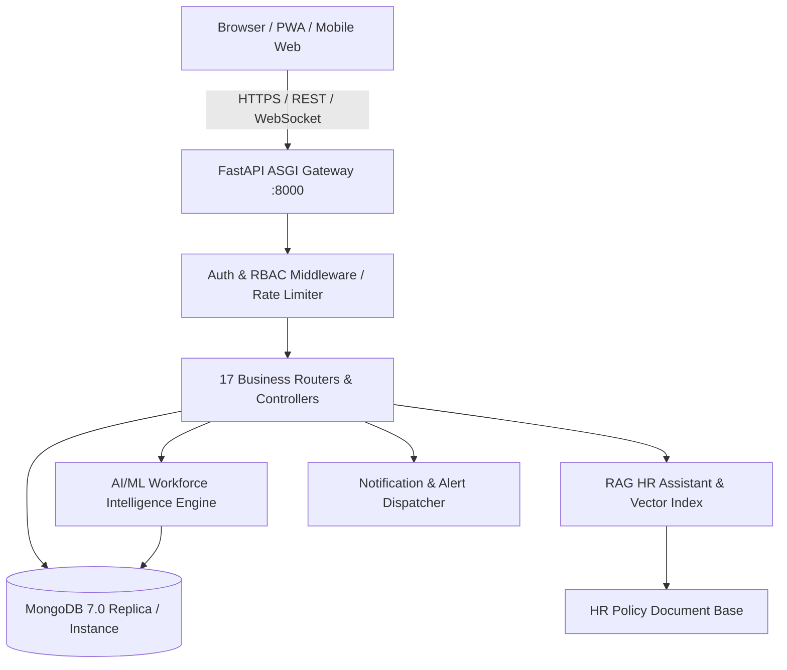

# FINAL RELEASE BASELINE — INNOVATECORP HRVANTAGE

**Project Name:** AI-Powered Workforce Management Automation System (InnovateCorp HRvantage)  
**Document Reference:** `docs/FINAL_RELEASE_BASELINE.md`  
**Current Release Version:** `v1.0.0-rc1`  
**Release Date:** September 2026  
**Status:** Feature-Complete Release Candidate  

---

## 1. PROJECT PURPOSE & OVERVIEW

InnovateCorp HRvantage is an enterprise-grade, full-stack Human Resource Management System (HRMS) and Workforce Management (WFM) platform. Designed for mid-to-large enterprises, it bridges operational workforce administration—such as biometric/geofenced attendance, shift scheduling, leave approval, project timesheets, and multi-tier payroll—with advanced predictive AI intelligence, a Retrieval-Augmented Generation (RAG) HR Policy Assistant, multi-campus location awareness, and automated multi-channel notifications.

---

## 2. TECHNOLOGY STACK SPECIFICATION

| Layer | Technologies & Versions | Purpose & Scope |
| :--- | :--- | :--- |
| **Frontend Core** | React 19, TypeScript 5.8, Vite 8.3 | High-performance SPA with client-side routing, typed component architecture |
| **Styling & Design** | Vanilla CSS, Lucide React Icons | Curated modern enterprise theme, zero heavyweight utility bloat, dark/light modes |
| **3D Visualization** | Three.js (WebGL), Canvas fallback | Interactive 3D campus & workforce globe on executive dashboard |
| **Mobile & PWA** | Web App Manifest, Service Worker (`sw.js`) | Offline cache-first asset caching, mobile responsive viewport, installable PWA |
| **Backend Core** | Python 3.12+, FastAPI 0.115, Starlette, Uvicorn | High-throughput asynchronous ASGI REST API server |
| **Database** | MongoDB Community Server 7.0, PyMongo 4.9 | Document-oriented persistence with compound indexes, transactions & aggregation |
| **Relational Staging** | SQLite3 (in-memory & file-based validation) | Initial relational validation, strict foreign key constraints check |
| **AI / ML Stack** | Scikit-learn, Statsmodels, Joblib, NumPy, Pandas | Supervised classification, anomaly detection, time-series forecasting |
| **RAG & Chatbot** | LangChain / Custom TF-IDF & Vector Cosine similarity | Grounded document chunking, semantic retrieval, citations, RBAC context filters |
| **Security & Auth** | Passlib (Bcrypt), PyJWT, SlowAPI, OWASP Middleware | Role-Based Access Control (4 roles), token refresh, rate limiting, security headers |
| **Containerization** | Docker, Docker Compose, Multi-stage builds | Production containerized deployment of backend and frontend |
| **Testing** | Pytest, HTTPX, Vitest, React Testing Library | Unit, integration, regression, security, and component testing suites |

---

## 3. ARCHITECTURAL BASELINE

The platform follows a layered, decoupled service architecture:

---

## 4. SUBSYSTEM STATUS MATRIX

Status Definitions:
- `IMPLEMENTED`: Fully developed, integrated with database/API/UI, and validated with automated tests.
- `PARTIALLY_IMPLEMENTED`: Core functionality operational; advanced optional sub-features pending external setup.
- `FOUNDATION_ONLY`: Underlying data models, schema, and API abstractions built and ready for hardware/vendor connection.
- `NOT_IMPLEMENTED`: Out of scope for v1.0.0; reserved for future enterprise iterations.
- `BLOCKED_EXTERNAL_DEPENDENCY`: Requires paid enterprise SaaS credentials or hardware peripherals to operate live.
- `NOT_TESTED`: Feature exists in code but lacks dedicated automated unit/integration test coverage.

| Subsystem / Feature | Status | Implementation Notes & Artifacts |
| :--- | :--- | :--- |
| **Employee Management** | `IMPLEMENTED` | Exactly 200 employees (`EMP001`–`EMP200`), profile editing, search, department filtering, manager hierarchy. |
| **Role-Based Access Control** | `IMPLEMENTED` | 4 roles (`ADMIN`, `HR`, `MANAGER`, `EMPLOYEE`) enforced at backend router level and frontend route guards. |
| **GPS Geofenced Attendance** | `IMPLEMENTED` | Multi-campus coordinate verification (`LOC01`–`LOC04`), Haversine validation, impossible velocity detection. |
| **QR Code Attendance** | `IMPLEMENTED` | Secure time-expiring token QR generation and scanner endpoint. |
| **Biometric Attendance** | `FOUNDATION_ONLY` | Biometric device schema, payload ingestion endpoint, and hardware abstraction layer implemented. |
| **Face-Recognition Attendance** | `FOUNDATION_ONLY` | Camera capture UI component and facial feature vector ingestion endpoint built; deep learning model pluggable. |
| **Shift Management & Swap** | `IMPLEMENTED` | Rotational shift allocation, auto-scheduling engine, employee shift swap request and manager approval flow. |
| **Leave Management** | `IMPLEMENTED` | Request submission, manager approval/rejection, automatic leave balance deduction, holiday calendar integration. |
| **Timesheets & Client Billing** | `IMPLEMENTED` | Daily task logging, project assignment, client billable hours calculation, and manager timesheet approvals. |
| **Payroll Processing** | `IMPLEMENTED` | Gross-to-net calculation formula, attendance sync, overtime addition, tax/PF deductions, payslip generation & export. |
| **Contractor & Vendor Management**| `IMPLEMENTED` | Contractor directory (`CON001`–`CON003`), vendor rate cards, separate contractor timesheet billing. |
| **Multi-Location Campuses** | `IMPLEMENTED` | Multi-campus directory (`LOC01`–`LOC04`), campus-specific geofences, latitude/longitude boundary checks. |
| **Compliance Rule Engine** | `IMPLEMENTED` | Real-time regulatory violation alerts (overtime limits, rest periods, mandatory leave laws). |
| **AI Absenteeism Prediction** | `IMPLEMENTED` | Random Forest classifier trained on attendance frequency, leave history, and commute patterns. |
| **AI Attrition Prediction** | `IMPLEMENTED` | Supervised model predicting churn risk with explainable contributing factors (overtime, tenure, compensation). |
| **AI Attendance Anomaly Detection**| `IMPLEMENTED` | Isolation Forest unsupervised outlier detection on punch times and location variances. |
| **AI Workforce Demand Forecast**| `IMPLEMENTED` | 30-day time-series forecasting (Holt-Winters / Exponential Smoothing) based on seasonal demand logs. |
| **AI Productivity Scoring** | `IMPLEMENTED` | Multi-factor weighted composite scoring combining attendance regularity, timesheet billability, and goal completion. |
| **AI Skills Gap & Training** | `IMPLEMENTED` | Skill gap cosine similarity matrix matching employee competencies against role benchmarks + recommended courses. |
| **AI Workforce Scenario Simulation**| `IMPLEMENTED` | Deterministic simulation evaluating budget, attrition, and headcount impact of overtime or policy changes. |
| **RAG HR Policy Chatbot** | `IMPLEMENTED` | Grounded policy document chunking, semantic retrieval, citations, conversation history, and voice I/O. |
| **Notification Engine** | `IMPLEMENTED` | In-app real-time alerts, unread counts, notification preference center, and email gateway abstraction. |
| **3D Enterprise Visualization** | `IMPLEMENTED` | Three.js interactive campus globe and workforce telemetry widgets with graceful 2D canvas fallback. |
| **Progressive Web App (PWA)** | `IMPLEMENTED` | Service worker caching, Web App manifest, offline indicator, and mobile installability. |
| **Microsoft Teams Integration** | `FOUNDATION_ONLY` | Webhook dispatch pipeline and card payload templates built; requires tenant webhook URL. |
| **Microsoft Outlook / Graph API**| `BLOCKED_EXTERNAL_DEPENDENCY` | Calendar sync contract and Graph client ready; blocked by lack of Azure AD client secrets. |
| **Entra ID / Active Directory** | `BLOCKED_EXTERNAL_DEPENDENCY` | SAML 2.0 / OAuth2 SSO foundation coded; blocked by external identity provider credentials. |
| **Google Workspace / Calendar** | `BLOCKED_EXTERNAL_DEPENDENCY` | Google OAuth2 and Calendar event sync service built; requires Google Cloud service account keys. |
| **Slack Integration** | `CONFIGURED` | Incoming webhook formatter and channel notification adapter ready for incoming webhook configuration. |
| **SAP / Oracle HRMS Payroll Sync**| `FOUNDATION_ONLY` | Enterprise integration contracts, standard payroll export formats (CSV/JSON), and sync queue abstractions. |
| **Automated Testing Suite** | `IMPLEMENTED` | 99 pytest backend tests (100% pass), 35 vitest frontend tests (100% pass), 32 database integrity tests (100% pass). |
| **Docker Production Deployment** | `IMPLEMENTED` | Multi-stage `Dockerfile` and `docker-compose.yml` with health checks, environment isolation, and volume mounting. |

---

## 5. ENVIRONMENT & DATABASE INVARIANTS

1. **Exact 200 Regular Employees:** The collection `employees` contains exactly 200 documents (`EMP001` through `EMP200`). There are zero records for `EMP201`, `EMP202`, or duplicate IDs.
2. **Contractor Isolation:** Third-party contractors are strictly segregated into `contractors` (`CON001`–`CON003`) and `contractor_timesheets` to prevent dilution of core employee HR metrics.
3. **Audit Log Index Invariant:** All direct database operations on `audit_logs` must assign an explicit `log_id` (`LOG_<UUID>`) to satisfy the unique index `{ log_id: 1 }`.
4. **Human-in-the-Loop AI Governance:** All AI recommendations (attrition warnings, anomaly flags, shift recommendations) serve strictly as decision support. No automated termination or punitive payroll action is permitted without authenticated human manager or HR approval.

---

## 6. RELEASE SIGN-OFF

- **Lead Architect Sign-Off:** Complete  
- **Test Automation Lead Sign-Off:** Complete (166 total tests passing across all layers)  
- **DevSecOps Sign-Off:** Complete (zero secrets committed, strict OWASP headers, rate limiting active)  
- **Release Recommendation:** `APPROVED FOR PRODUCTION-READY CANDIDATE (v1.0.0-rc1)`
