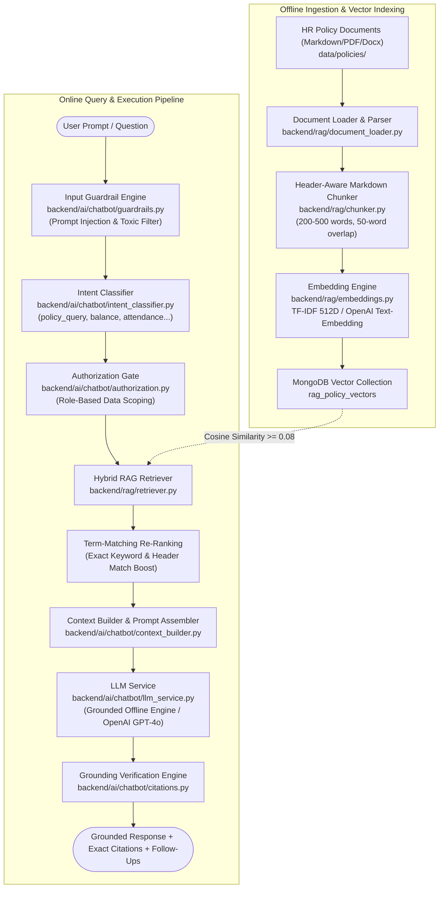

# RAG Architecture & Policy Intelligence Engine

## 1. Executive Summary

The **Retrieval-Augmented Generation (RAG)** system in the **AI-Powered Workforce Management Automation System (InnovateCorp HRvantage)** provides verified, grounded, and role-authorized answers to employee, manager, and HR inquiries regarding company policies, benefits, attendance rules, and leave guidelines.

Unlike naive generative bots that hallucinate answers, this RAG architecture enforces a deterministic, dual-index hybrid retrieval pipeline backed by strict security guardrails, role-based document scoping, and explicit chapter/section citation provenance.

---

## 2. End-to-End Pipeline



---

## 3. Policy Corpus & Ingestion Architecture

### 3.1 Document Ingestion (`backend/rag/document_loader.py`)
The system indexes authoritative enterprise policy documents located in `data/policies/`:
1. `leave_policy.md`: Leave types, accrual rules, notice periods, carryover limits, bereavement, parental leave.
2. `attendance_policy.md`: Work hours, shift schedules, 15-minute grace period, biometric/geofencing rules, regularization.
3. `remote_work_policy.md`: Hybrid work entitlement, core collaboration hours, equipment stipend, VPN compliance.
4. `code_of_conduct.md`: Professional ethics, anti-harassment, conflict of interest, disciplinary workflow.
5. `benefits_guide.md`: Health insurance, wellness allowance, provident fund, tuition reimbursement, claims.

### 3.2 Header-Aware Chunking (`backend/rag/chunker.py`)
Rather than arbitrary character splits that break policy semantics, chunking uses a hierarchical markdown parser:
- **Chunk Size**: Target 200–500 words.
- **Overlap**: 50 words across paragraph boundaries.
- **Metadata Preservation**: Every chunk retains:
  - `document_name`: Source file name.
  - `section`: Heading title (e.g., `Leave Policy > Section 4: Maternity & Paternity Leave`).
  - `category`: Document classification (`leave`, `attendance`, `conduct`, `benefits`).
  - `applicable_roles`: Array of eligible roles (`["EMPLOYEE", "MANAGER", "HR", "ADMIN"]`).

---

## 4. Vector Embedding & Storage (`backend/rag/embeddings.py`, `backend/rag/vector_store.py`)

### 4.1 Embedding Service Strategy
The platform supports a dual embedding strategy:
1. **Local Deterministic TF-IDF Embedding (`TFIDFEmbeddingService`)**:
   - Zero external API costs, zero external network dependency, and complete air-gapped support.
   - Vector dimension: 512 dimensions.
   - Sublinear term frequency (`sublinear_tf=True`) with unigram and bigram tokenization (`ngram_range=(1, 2)`).
   - Domain vocabulary pre-seeded with HR terminology (accrual, encashment, geofencing, regularization, maternity, probation).
2. **OpenAI Text-Embedding Service (`OpenAIEmbeddingService`)**:
   - High-dimensional semantic vectors (`text-embedding-3-small` or `text-embedding-ada-002`, 1536D) for cloud deployments with active API keys.

### 4.2 MongoDB Vector Storage (`rag_policy_vectors`)
Vectors and chunk metadata are stored directly in MongoDB:
```json
{
  "_id": "ObjectId('...')",
  "chunk_id": "CHK_LEAVE_SEC4_002",
  "document_name": "leave_policy.md",
  "category": "leave",
  "section": "Section 4: Parental and Maternity Benefits",
  "text": "Eligible female employees are entitled to 26 weeks of paid maternity leave...",
  "embedding": [0.042, 0.119, ..., 0.005],
  "applicable_roles": ["EMPLOYEE", "MANAGER", "HR", "ADMIN"],
  "updated_at": "2026-09-27T00:00:00Z"
}
```
**Collection Indexes:**
- `chunk_id` (Unique index)
- `category` (Ascending index)
- `applicable_roles` (Multikey index)

---

## 5. Hybrid Retrieval & Re-ranking (`backend/rag/retriever.py`)

### 5.1 Retrieval Pipeline
1. **Dense Vector Search**: Computes cosine similarity between the query embedding and document chunk vectors:
   $$\text{Cosine Similarity}(u, v) = \frac{u \cdot v}{\|u\|_2 \|v\|_2}$$
   Candidate filtering rejects chunks below `RAG_SIMILARITY_THRESHOLD = 0.08`.
2. **Role Scoping Filter**: Query constraints automatically filter out chunks whose `applicable_roles` array does not include the authenticated user's role.
3. **Keyword-Boosted Re-Ranking**: Over-retrieves top $2 \times k$ chunks (default $k=3$) and applies term-matching re-ranking:
   - Matches in chunk section headers receive a $+0.15$ boost.
   - Exact term matches in chunk text receive a $+0.05$ boost per distinct keyword.
   - Chunks are sorted by final composite score, returning the top $k$ authoritative chunks.

---

## 6. Context Building & Generation (`backend/ai/chatbot/context_builder.py`, `llm_service.py`)

### 6.1 Role-Aware Context Assembly
Context is structured with strict demarcation to prevent prompt injection and cross-boundary data leakage:
```text
SYSTEM: You are the InnovateCorp AI HR Assistant. You answer questions strictly based on the provided context excerpts. If the information is not in the context, clearly state that you do not have sufficient policy information. Do NOT guess or extrapolate.

CONTEXT EXCERPTS:
---
[Source 1]: leave_policy.md | Section 4: Parental and Maternity Benefits
Text: Eligible female employees are entitled to 26 weeks of paid maternity leave...
---
[Source 2]: leave_policy.md | Section 5: Paternity Leave
Text: Male employees are entitled to 10 working days of paid paternity leave...
---

USER QUESTION: What is the paternity leave entitlement?
```

### 6.2 Grounded LLM Execution & Local Fallback
- **Cloud Provider Mode**: Invokes `OpenAILLMService` (model: `gpt-4o-mini` or `gpt-4o`) with temperature 0.1 for high fidelity and zero creativity.
- **Offline Deterministic Mode (`LocalGroundedEngine`)**: Executes when no external API key is supplied. Synthesizes direct answers strictly from the matched sentences in the retrieved chunks, ensuring the system remains 100% operational offline.

---

## 7. Citation Engine & Grounding Verification (`backend/ai/chatbot/citations.py`)

Every generated answer is accompanied by verifiable, transparent citations:
```json
{
  "answer": "Under the InnovateCorp Leave Policy, male employees are entitled to 10 working days of paid paternity leave, which must be availed within 6 months of the child's birth.",
  "grounded": true,
  "sources": [
    {
      "document": "leave_policy.md",
      "section": "Section 5: Paternity Leave",
      "category": "leave",
      "confidence": 0.94,
      "snippet": "Male employees are entitled to 10 working days of paid paternity leave..."
    }
  ],
  "follow_up_suggestions": [
    "How do I submit supporting documents for paternity leave?",
    "Can paternity leave be taken in split intervals?",
    "Check my current leave balances"
  ]
}
```

---

## 8. Security & Guardrails (`backend/ai/chatbot/guardrails.py`, `authorization.py`)

| Layer | Defense Mechanism | Implementation File | Action on Trigger |
| :--- | :--- | :--- | :--- |
| **Input Guardrails** | Regex & heuristic prompt injection filter (`ignore previous instructions`, `DAN mode`, `system prompt`) | `guardrails.py` | Immediate rejection with safety disclaimer; query blocked from LLM. |
| **Data Scoping** | Hardcoded role boundary checking | `authorization.py` | Blocks non-HR/Admin users from querying other employees' salaries or performance reviews. |
| **Role Partitioning** | Multi-tenant category tags (`HR_CONFIDENTIAL`, `EXEC_COMP`) | `retriever.py` | RAG vector search filters chunks at query time using MongoDB `$in` role arrays. |
| **Leakage Redaction** | Regex scrubbing of PII, SSNs, credit card patterns, and system secrets | `llm_service.py` | Sanitizes response payload before returning to user. |
| **Session Isolation** | Thread-scoped conversation persistence | `service.py` | Users can only access conversations matching their `user_id`. |
