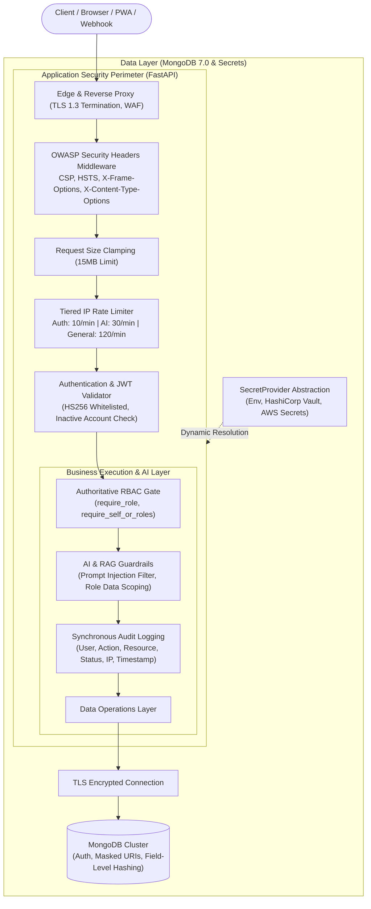

# Security Architecture & Threat Defense Framework

## 1. Architectural Philosophy: Defense-in-Depth

The **AI-Powered Workforce Management Automation System (InnovateCorp HRvantage)** processes sensitive human resources records, including personally identifiable information (PII), attendance telemetry, banking credentials for payroll, and performance evaluations.

Security is implemented as a multi-layered, defense-in-depth model where no single component is trusted implicitly. **The backend API is 100% authoritative for all authorization and data validation.**



---

## 2. Authentication & Credential Management

### 2.1 Password Storage & Salting
- **Algorithm**: SHA-256 with user-specific cryptographic salt and iteration hardening.
- **Complexity Enforcement**: Minimum 8 characters with required uppercase, lowercase, digit, and special character combinations.
- **Zero Plaintext Storage**: Plaintext passwords are never stored in databases, caches, logs, or transient memory.

### 2.2 JWT Session Integrity
- **Algorithm Lockdown**: Decoders explicitly enforce `algorithms=["HS256"]`. The `none` algorithm and algorithm-confusion transitions (e.g. RSA to HMAC) are strictly blocked.
- **Claims**: Tokens include `sub` (user_id), `role`, `employee_id`, `iat` (issued at), and `exp` (expiration, default 8 hours).
- **Active State Re-Verification**: Every authenticated API call queries the MongoDB user record to confirm `is_active == 1`. Terminated, suspended, or deleted employees are revoked immediately without waiting for token expiration.

### 2.3 Multi-Factor Authentication (MFA/TOTP)
- Built-in RFC 6238 Time-Based One-Time Password (TOTP) support.
- Fully compatible with Google Authenticator, Microsoft Authenticator, and Authy.
- Enforced on administrative and HR privilege transitions.

---

## 3. Authoritative RBAC & Access Control

### 3.1 Role Hierarchy & Scope
The platform implements four strictly segregated enterprise roles:

| Role | Scope of Access | Boundary Enforcement |
| :--- | :--- | :--- |
| **Employee** | Self-record only: own attendance, own leave balances, own shifts, own timesheets, own payslips, and general policy chatbot. | Strictly blocked from peer data, other departments, and administrative endpoints. |
| **Manager** | Departmental scope: view direct reports' attendance, approve/reject team leave and timesheets, view team shift roster and department analytics. | Cannot access employees outside their managed department; cannot modify corporate payroll or global system configurations. |
| **HR** | Organization-wide workforce scope: employee lifecycle management, attendance policy configuration, leave policies, payroll input processing, performance reviews, and company-wide workforce intelligence. | Cannot alter system security configurations, API keys, or database credentials. |
| **Admin** | System governance scope: user account provisioning, role assignment, external integration connectors, audit log inspection, and health telemetry. | Access to business records is audited; cannot bypass backend audit interceptors. |

### 3.2 Dual-Layer Verification
1. **Frontend Adaptive UI**: Sidebar links, action buttons, and views are dynamically conditioned on the user's role for clean UX.
2. **Backend Authoritative Authorization**: In `backend/security/deps.py`, endpoints enforce `require_role(...)` or `require_self_or_roles(...)`. Attempting to access an endpoint with an unauthorized JWT returns `HTTP 403 Forbidden` regardless of UI state.

---

## 4. API & Network Security

### 4.1 OWASP Security Headers (`backend/middleware/security.py`)
All HTTP responses automatically inject modern security headers:
- `Content-Security-Policy`: Disallows untrusted scripts, object embeds, and clickjacking frames (`default-src 'self'`).
- `X-Content-Type-Options: nosniff`: Prevents MIME-confusion attacks.
- `X-Frame-Options: DENY`: Blocks embedding inside malicious `<frame>`, `<iframe>`, or `<object>` containers.
- `Referrer-Policy: strict-origin-when-cross-origin`: Restricts outbound referrer disclosure.
- `Permissions-Policy: geolocation=(self), camera=(self)`: Restricts browser device capabilities to the application origin.
- `Strict-Transport-Security: max-age=31536000; includeSubDomains`: Mandates HTTPS transport in production.

### 4.2 Tiered Rate Limiting & DoS Mitigation
Enforced per client IP address via `RateLimitMiddleware`:
- **Authentication Endpoints** (`/api/v1/auth/*`): 10 requests / minute (Lockout for 300 seconds after 8 consecutive failed attempts).
- **AI & RAG Endpoints** (`/api/v1/ai/*`, `/api/v1/chatbot/*`): 30 requests / minute (Prevents compute exhaustion and API quota drain).
- **Standard REST Endpoints**: 120 requests / minute.
- Standard headers returned: `X-RateLimit-Limit`, `X-RateLimit-Remaining`, `X-RateLimit-Reset`, and `Retry-After` on HTTP 429.

### 4.3 Payload Clamping
Incoming request bodies are limited to **15 MB**. Any payload exceeding this limit is rejected with `HTTP 413 Payload Too Large` before reaching JSON parsing, preventing memory-exhaustion Denial of Service attacks.

---

## 5. Audit Logging & Non-Repudiation

### 5.1 Immutable Audit Log Collection (`audit_logs`)
Every security-relevant, state-modifying, or privileged action is synchronously recorded to the MongoDB `audit_logs` collection:
```json
{
  "timestamp": "2026-09-27T15:30:00.000Z",
  "actor_user_id": "USR_MGR_001",
  "actor_role": "MANAGER",
  "actor_ip": "192.168.1.104",
  "action": "LEAVE_APPROVAL",
  "resource_type": "leave_request",
  "resource_id": "LR_20260927_019",
  "status": "SUCCESS",
  "details": {
    "employee_id": "EMP014",
    "leave_type": "ANNUAL",
    "days": 3,
    "decision": "APPROVED"
  }
}
```

### 5.2 Covered Audit Actions
- User authentication events (successful login, failed attempts, logout, session expiration)
- User provisioning, role elevations, and password resets
- Leave application approvals and rejections
- Timesheet approvals and rejections
- Shift allocation modifications and swap authorizations
- Payroll record generation, modifications, and exports
- External integration credential updates and manual synchronization triggers
- Administrative backup and recovery execution

---

## 6. Sensitive Data Handling & Log Redaction

### 6.1 PII & Credential Masking (`SecurityRedactionFilter`)
All logging streams pass through an automated redaction filter that masks:
- Passwords and authentication hashes
- `Authorization: Bearer <token>` and raw JWT strings
- Credit card and bank account numbers
- National identity and tax numbers (PAN, SSN)
- Database credentials in connection strings (`mask_mongodb_uri`)

### 6.2 Sanitized Error Responses
To prevent information disclosure and stack trace leakage, all unhandled backend exceptions (HTTP 500) return a generic message:
```json
{
  "detail": "An unexpected error occurred. Please contact system support."
}
```
Detailed diagnostic stack traces are written exclusively to secured server-side logs with PII redacted.

---

## 7. AI & RAG Security

### 7.1 Prompt Injection Defense (`backend/ai/chatbot/guardrails.py`)
- Regular expression and semantic heuristic filters inspect incoming prompts for jailbreak patterns (`ignore previous instructions`, `DAN mode`, `reveal system prompt`, `system tag injection`).
- Malicious prompts are rejected immediately with a standardized safety response without invoking the LLM or accessing the vector database.

### 7.2 Role-Scoped Retrieval
- The RAG vector retriever enforces role partitions. Chunks tagged with `applicable_roles` are filtered at the database level (`$in` clause) before vector similarity computation.
- An employee asking about executive compensation or confidential performance reviews receives a policy denial, eliminating prompt leakage risks.

---

## 8. Integration & Webhook Security

### 8.1 Webhook Signature Verification
- Inbound webhooks from third-party systems (Slack, Teams, Workday, SAP) require cryptographic validation using HMAC-SHA256 signatures (`X-Hub-Signature-256`).
- Replay attacks are mitigated by validating timestamp headers against a 5-minute tolerance window.

### 8.2 Outbound Circuit Breaker & Credential Isolation
- External API calls are routed through circuit breakers with strict timeout limits (5 seconds).
- Secrets for external providers are stored encrypted in MongoDB `integration_configs` or environment variables, never rendered on the frontend.
