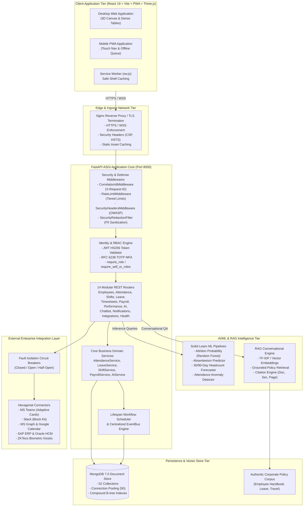
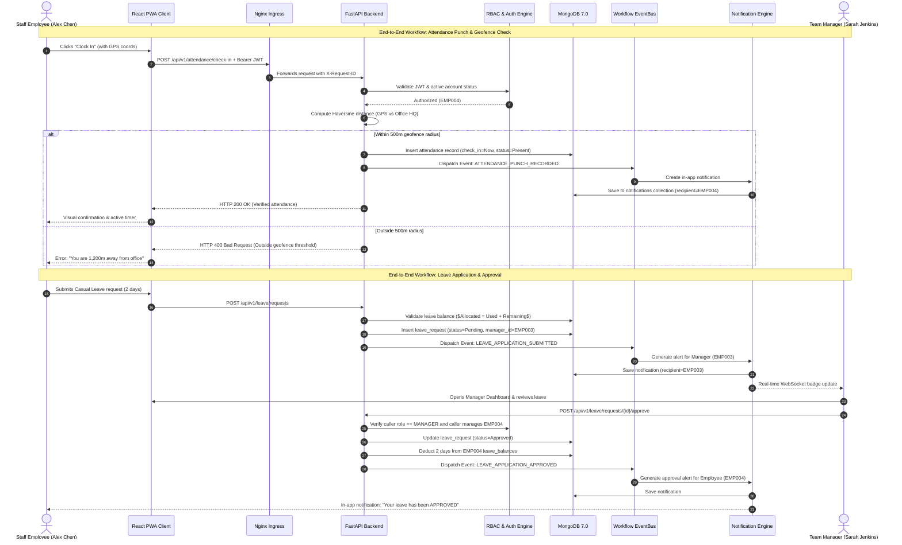
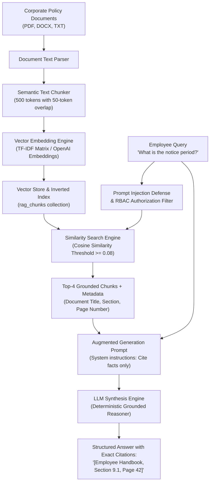
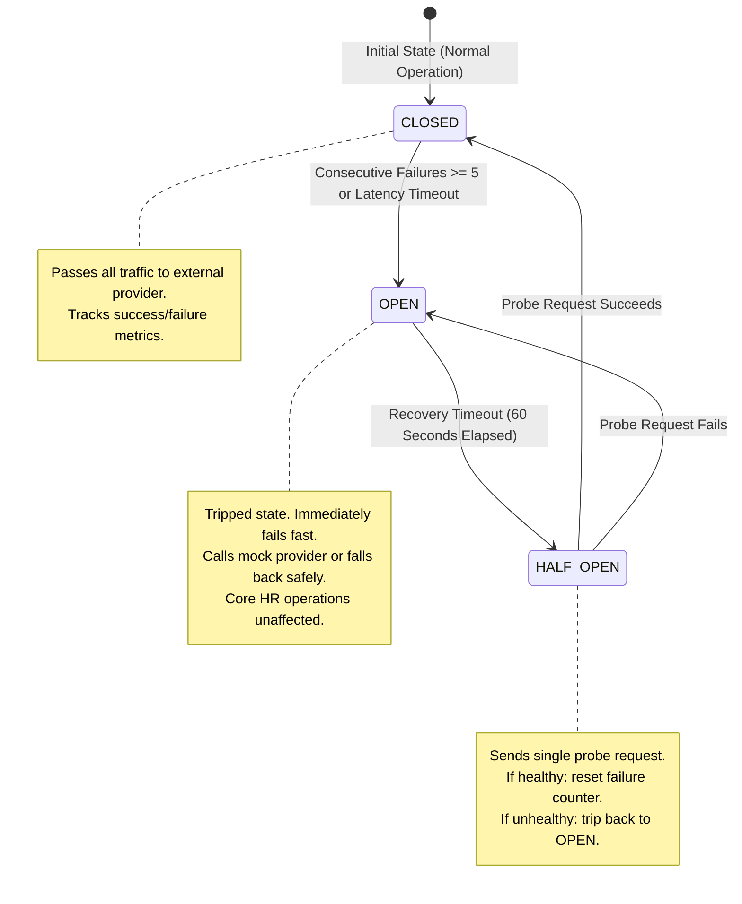

# FINAL SYSTEM ARCHITECTURE & DATA FLOW SPECIFICATION

**System:** AI-Powered Workforce Management Automation System (InnovateCorp HRvantage)  
**Document:** Final System Architecture & Data Flow Diagrams  
**Phase:** 13 — Final Consolidation  
**Version:** 1.0  
**Format:** Maintainable Mermaid Diagram Architecture  

---

## 1. High-Level Enterprise System Topology

---

## 2. Comprehensive Data Flow Diagram

---

## 3. RAG Conversational Retrieval Architecture

---

## 4. Hexagonal Integration Layer & Circuit Breaker Model

