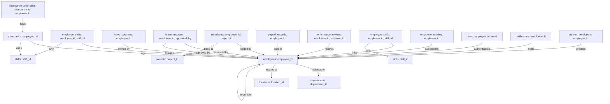

# MongoDB Database Architecture Documentation
## AI-Powered Workforce Management Automation System (Phase 2)

This document provides complete technical documentation for the MongoDB database layer supporting the HR Automation Platform.

---

## 1. Database Technology Overview

- **Database**: **MongoDB 8.x** (Running as local service or MongoDB Atlas via connection string)
- **Database Name**: `hr_automation`
- **Driver**: **PyMongo 4.x** (Official Python driver)
- **GUI Recommended**: **MongoDB Compass** (`mongodb://localhost:27017/`)
- **Configuration**: Loaded dynamically from `.env` via `python-dotenv`.

---

## 2. Collections Inventory & Record Counts

The database organizes 39,087 documents across 39 specialized collections:

| Category | Collection Name | Document Count | Key Unique/Compound Indexes |
|---|---|---|---|
| **Employee Management** | `employees` | **200** | `employee_id` (unique), `email` (unique) |
| | `departments` | **9** | `department_id` (unique), `code` (unique) |
| | `locations` | **5** | `location_id` (unique) |
| | `roles` | **4** | `role_name` (unique) |
| | `permissions` | **12** | `permission_code` (unique) |
| **Attendance** | `attendance` | **24,600** | `attendance_id` (unique), `(employee_id, date)` (unique) |
| | `attendance_anomalies` | **307** | `anomaly_id` (unique), `attendance_id` (unique) |
| **Shift Management** | `shifts` | **4** | `shift_id` (unique), `shift_name` (unique) |
| | `employee_shifts` | **200** | `schedule_id` (unique), `employee_id` |
| | `shift_swap_requests` | **2** | `swap_id` (unique), `requester_id` |
| | `overtime_records` | **3,161** | `overtime_id` (unique), `(employee_id, date)` |
| **Leave Management** | `leave_types` | **5** | `leave_type_code` (unique) |
| | `leave_balances` | **816** | `balance_id` (unique), `(employee_id, leave_type, year)` (unique) |
| | `leave_requests` | **573** | `leave_id` (unique), `employee_id`, `status` |
| | `holidays` | **10** | `holiday_id` (unique), `date` |
| **Timesheets** | `projects` | **8** | `project_id` (unique) |
| | `timesheets` | **4,000** | `timesheet_id` (unique), `(employee_id, date, project_id)` |
| | `timesheet_approvals` | **200** | `approval_id` (unique) |
| **Payroll** | `payroll_records` | **1,200** | `payroll_id` (unique), `(employee_id, month)` (unique) |
| | `payroll_components` | **7** | `component_code` (unique) |
| | `bonuses_incentives` | **400** | `bonus_id` (unique), `(employee_id, month)` |
| | `payroll_exports` | **5** | `export_id` (unique) |
| **Performance** | `performance_reviews` | **200** | `review_id` (unique), `employee_id` |
| | `performance_kpis` | **4** | `kpi_id` (unique) |
| | `employee_goals` | **200** | `goal_id` (unique), `employee_id` |
| | `productivity_records` | **200** | `record_id` (unique), `(employee_id, date)` |
| | `performance_scorecards`| **200** | `scorecard_id` (unique), `employee_id` |
| **Skills & Training** | `skills` | **18** | `skill_id` (unique), `skill_name` (unique) |
| | `employee_skills` | **808** | `(employee_id, skill_id)` (unique) |
| | `training_programs` | **8** | `program_id` (unique) |
| | `employee_training` | **507** | `training_id` (unique), `employee_id` |
| **Workforce Planning** | `workforce_forecasts` | **3** | `forecast_id` (unique) |
| | `staffing_recommendations`| **2** | `recommendation_id` (unique) |
| | `attrition_predictions`| **200** | `prediction_id` (unique), `employee_id` (unique) |
| | `resource_allocations` | **3** | `allocation_id` (unique) |
| **Security & Auth** | `users` | **204** | `user_id` (unique), `email` (unique) |
| | `audit_logs` | **2** | `log_id` (unique), `timestamp` (desc) |
| **Notifications** | `notifications` | **600** | `notification_id` (unique), `(employee_id, is_read)` |
| | `notification_preferences`| **200** | `employee_id` (unique) |

---

## 3. Relationships & Reference Architecture

In MongoDB, relationships are maintained via explicit string identifiers referencing the primary keys of related documents:



---

## 4. Key Document Schemas

### 4.1 Employee Document (`employees`)
```json
{
  "_id": {"$oid": "..."},
  "employee_id": "EMP001",
  "first_name": "Vikramaditya",
  "last_name": "Singhania",
  "gender": "Male",
  "date_of_birth": "1976-08-14",
  "email": "vikramaditya.singhania@innovatecorp.demo",
  "phone": "+91-9876543210",
  "address": "Penthouse 12, Jubilee Hills, Hyderabad",
  "joining_date": "2018-01-10",
  "employment_type": "Full-Time",
  "designation": "Chief Executive Officer",
  "department_id": "DEP07",
  "manager_id": null,
  "location_id": "LOC01",
  "salary": 5800000.0,
  "experience": 24.0,
  "employment_status": "Active",
  "role": "ADMIN"
}
```

### 4.2 Attendance Document (`attendance`)
```json
{
  "_id": {"$oid": "..."},
  "attendance_id": "ATT0000001",
  "employee_id": "EMP001",
  "date": "2025-10-01",
  "check_in": "08:52:14",
  "check_out": "18:12:45",
  "attendance_status": "Present",
  "attendance_method": "Biometric",
  "location_id": "LOC01",
  "late_minutes": 0,
  "overtime_hours": 0.0,
  "shift_id": "SH01",
  "anomaly_flag": 0,
  "anomaly_reason": null
}
```

### 4.3 Payroll Record Document (`payroll_records`)
```json
{
  "_id": {"$oid": "..."},
  "payroll_id": "PAY000001",
  "employee_id": "EMP001",
  "month": "2025-10",
  "base_salary": 483333.33,
  "overtime_pay": 0.0,
  "leave_deduction": 0.0,
  "incentives": 0.0,
  "bonuses": 48333.33,
  "gross_salary": 531666.66,
  "deductions": 121333.33,
  "net_salary": 410333.33,
  "payment_status": "Paid",
  "payment_date": "2025-10-31"
}
```

---

## 5. Operations & Execution Guide

### Starting MongoDB
Verify the MongoDB Windows service is running:
```powershell
Get-Service MongoDB
```

### Seeding / Re-importing Data
The seed pipeline is high-performance, idempotent, and re-runnable at any time without duplicating documents:
```powershell
# Clean replacement & import of all collections and indexes
python database/seed_database.py
```

### Validating the Database
Run the 28-point automated validation audit:
```powershell
python database/validate_database.py
```

### Running Automated Pytest Suite
Run the 10 automated test cases:
```powershell
pytest tests/test_database.py -v
```

### Inspecting with MongoDB Compass
1. Launch **MongoDB Compass**.
2. Connect to URI: `mongodb://localhost:27017/`
3. Open database: `hr_automation`.
