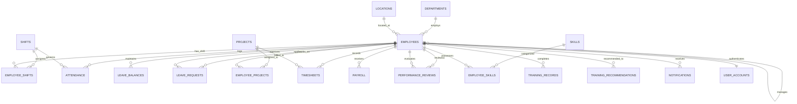

# Database Schema Documentation
## AI-Powered Workforce Management Automation System (Version 1.0)

This document describes the relational database schema implemented in `database/schema.sql` and instantiated in `data/hr_automation.db`.

---

## 1. Table Definitions

### 1.1 `locations`
Stores physical offices with geographic geofencing coordinates.
| Column | Type | Constraints | Description |
|---|---|---|---|
| `location_id` | TEXT | PRIMARY KEY | Location code (e.g. `LOC01`, `LOC02`) |
| `name` | TEXT | NOT NULL | Office name (e.g. Hyderabad Innovation Hub) |
| `city` | TEXT | NOT NULL | City name (Hyderabad, Bengaluru, Chennai, Pune, Mumbai) |
| `state` | TEXT | NOT NULL | State name |
| `country` | TEXT | NOT NULL | Country (India) |
| `latitude` | REAL | NOT NULL | GPS latitude |
| `longitude` | REAL | NOT NULL | GPS longitude |
| `geofence_radius_meters` | REAL | NOT NULL | Geofence perimeter in meters (e.g. 500.0) |
| `timezone` | TEXT | NOT NULL | Timezone identifier (`Asia/Kolkata`) |

### 1.2 `departments`
Company business units and functional departments.
| Column | Type | Constraints | Description |
|---|---|---|---|
| `department_id` | TEXT | PRIMARY KEY | Department code (e.g. `DEP01` to `DEP09`) |
| `name` | TEXT | NOT NULL, UNIQUE | Full name (e.g. Engineering, Data Science) |
| `code` | TEXT | NOT NULL, UNIQUE | Short code (e.g. `ENG`, `DS`, `HR`, `FIN`) |
| `description` | TEXT | | Department charter and mandate |
| `head_employee_id` | TEXT | | Employee ID of the Department Head / Director |
| `budget` | REAL | NOT NULL | Annual operational budget (INR) |

### 1.3 `shifts`
Standard working shifts for workforce planning.
| Column | Type | Constraints | Description |
|---|---|---|---|
| `shift_id` | TEXT | PRIMARY KEY | Shift code (e.g. `SH01` to `SH04`) |
| `shift_name` | TEXT | NOT NULL, UNIQUE | Shift name (General, Morning, Evening, Night) |
| `start_time` | TEXT | NOT NULL | 24h start time (`09:00`, `06:00`, etc.) |
| `end_time` | TEXT | NOT NULL | 24h end time (`18:00`, `15:00`, etc.) |
| `grace_period_mins` | INTEGER | NOT NULL | Late grace period in minutes (15) |
| `is_rotational` | INTEGER | NOT NULL | 0 = Fixed, 1 = Rotational |

### 1.4 `employees`
Core table containing **strictly 200 synthetic employees** (`EMP001` to `EMP200`).
| Column | Type | Constraints | Description |
|---|---|---|---|
| `employee_id` | TEXT | PRIMARY KEY | Strict ID: `EMP001` through `EMP200` |
| `first_name` | TEXT | NOT NULL | Fictional first name |
| `last_name` | TEXT | NOT NULL | Fictional last name |
| `gender` | TEXT | NOT NULL | Male / Female / Non-Binary |
| `date_of_birth` | TEXT | NOT NULL | YYYY-MM-DD |
| `email` | TEXT | NOT NULL, UNIQUE | Fictional business email |
| `phone` | TEXT | NOT NULL | Fictional mobile number |
| `address` | TEXT | NOT NULL | Fictional residential address |
| `joining_date` | TEXT | NOT NULL | Date joined company (YYYY-MM-DD) |
| `employment_type` | TEXT | NOT NULL | `Full-Time`, `Contract`, `Intern` |
| `designation` | TEXT | NOT NULL | Title (e.g. Senior Software Engineer) |
| `department_id` | TEXT | NOT NULL, FK | References `departments(department_id)` |
| `manager_id` | TEXT | FK | References `employees(employee_id)`, NULL for CEO |
| `location_id` | TEXT | NOT NULL, FK | References `locations(location_id)` |
| `salary` | REAL | NOT NULL | Annual base salary in INR |
| `experience` | REAL | NOT NULL | Total years of experience |
| `employment_status` | TEXT | NOT NULL | `Active`, `On Notice`, `On Leave` |
| `role` | TEXT | NOT NULL | `ADMIN`, `HR`, `MANAGER`, `EMPLOYEE` |
| `created_at` | TEXT | NOT NULL | Record creation timestamp |

### 1.5 `skills` and `employee_skills`
Skills taxonomy and employee proficiency mapping.
- `skills`: `skill_id`, `skill_name`, `category` (Technical, Data & AI, Management, Soft Skills).
- `employee_skills`: composite PK (`employee_id`, `skill_id`), `proficiency_level` (Beginner, Intermediate, Advanced, Expert), `years_experience`.

### 1.6 `projects` and `employee_projects`
Projects and team staffing allocations.
- `projects`: `project_id`, `project_name`, `client_name`, `department_id`, `start_date`, `end_date`, `status`, `budget`.
- `employee_projects`: `assignment_id`, `employee_id`, `project_id`, `role`, `allocation_percentage`, `start_date`, `end_date`.

### 1.7 `employee_shifts`
Shift roster linking employees to active schedules.
- `schedule_id`, `employee_id`, `shift_id`, `effective_from`, `effective_to`.

### 1.8 `attendance`
6-month daily clock-in/clock-out records with anomaly annotations.
- `attendance_id`, `employee_id`, `date`, `check_in`, `check_out`, `attendance_status`, `attendance_method`, `location_id`, `late_minutes`, `overtime_hours`, `shift_id`, `anomaly_flag`, `anomaly_reason`.

### 1.9 `leave_balances` and `leave_requests`
Leave administration and balances.
- `leave_balances`: `balance_id`, `employee_id`, `leave_type`, `allocated_days`, `used_days`, `remaining_days`, `year`.
- `leave_requests`: `leave_id`, `employee_id`, `leave_type`, `start_date`, `end_date`, `days_count`, `reason`, `status`, `approved_by`, `created_at`.

### 1.10 `timesheets`
Work logging and billable hours.
- `timesheet_id`, `employee_id`, `date`, `project_id`, `hours_worked`, `billable_hours`, `non_billable_hours`, `overtime_hours`, `status`.

### 1.11 `payroll`
Monthly payroll inputs and calculations.
- `payroll_id`, `employee_id`, `month`, `base_salary`, `overtime_pay`, `leave_deduction`, `incentives`, `bonuses`, `gross_salary`, `deductions`, `net_salary`, `payment_status`, `payment_date`.
- Formula:
  $$\text{gross\_salary} = \text{base\_salary} + \text{overtime\_pay} + \text{incentives} + \text{bonuses}$$
  $$\text{deductions} = \text{tax\_deduction} + \text{pf\_deduction} + \text{leave\_deduction}$$
  $$\text{net\_salary} = \text{gross\_salary} - \text{deductions}$$

### 1.12 `performance_reviews`
Annual / biannual performance evaluations.
- `review_id`, `employee_id`, `kpi_score` (0-100), `goal_completion` (0-100%), `productivity_score` (0-100), `manager_feedback`, `performance_rating`, `review_date`, `reviewer_id`.

### 1.13 `training_records` and `training_recommendations`
L&D tracking and AI-driven skill gap recommendations.
- `training_records`: `training_id`, `employee_id`, `training_name`, `skill`, `completion_status`, `start_date`, `completion_date`, `score`.
- `training_recommendations`: `recommendation_id`, `employee_id`, `recommended_course`, `target_skill`, `reason`, `created_at`.

### 1.14 `company_holidays`
Official calendar of non-working public and festival holidays.
- `holiday_id`, `holiday_name`, `date`, `location_id`.

### 1.15 `notifications`
System announcements and user notifications.
- `notification_id`, `employee_id`, `category`, `title`, `message`, `is_read`, `created_at`.

### 1.16 `user_accounts`
RBAC authentication credentials.
- `user_id`, `employee_id`, `email`, `password_hash`, `role`, `is_active`, `created_at`.
