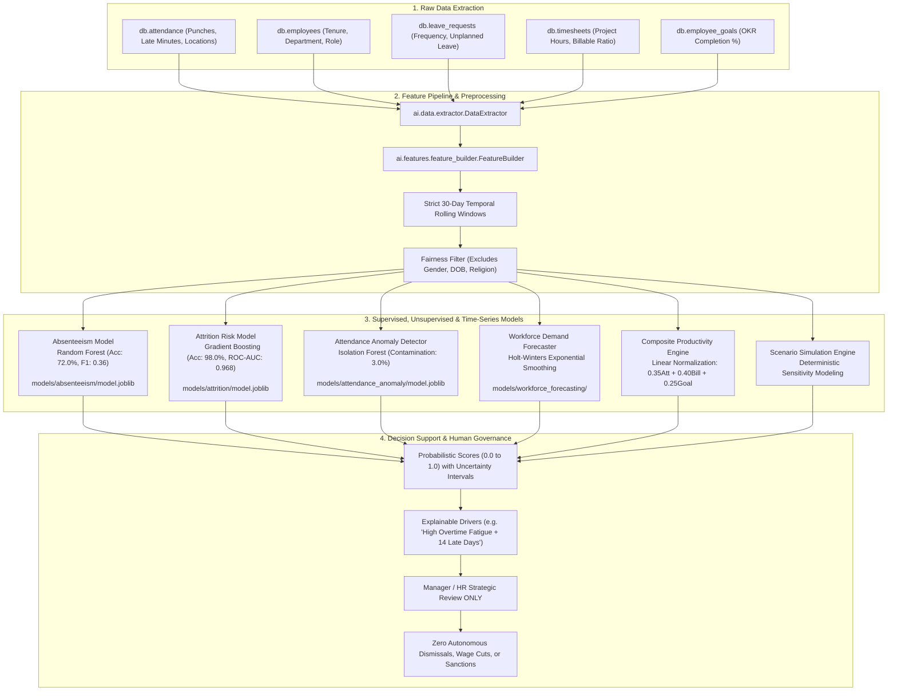

# AI / ML WORKFORCE INTELLIGENCE ARCHITECTURE DIAGRAM

**System:** AI-Powered Workforce Management Automation System (InnovateCorp HRvantage)  
**Document:** `docs/diagrams/ai_ml_architecture.md`  

---

