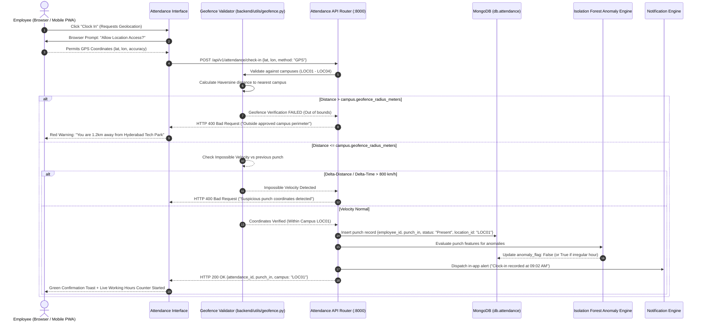

# ATTENDANCE WORKFLOW DIAGRAM

**System:** AI-Powered Workforce Management Automation System (InnovateCorp HRvantage)  
**Document:** `docs/diagrams/attendance_flow.md`  

---

```mermaid
sequenceDiagram
    autonumber
    actor Emp as Employee (Browser / Mobile PWA)
    participant UI as Attendance Interface
    participant Geo as Geofence Validator (backend/utils/geofence.py)
    participant API as Attendance API Router (:8000)
    participant DB as MongoDB (db.attendance)
    participant AI as Isolation Forest Anomaly Engine
    participant Notify as Notification Engine

    Emp->>UI: Click "Clock In" (Requests Geolocation)
    UI->>Emp: Browser Prompt: "Allow Location Access?"
    Emp-->>UI: Permits GPS Coordinates (lat, lon, accuracy)
    UI->>API: POST /api/v1/attendance/check-in {lat, lon, method: "GPS"}
    
    API->>Geo: Validate against campuses (LOC01 - LOC04)
    Geo->>Geo: Calculate Haversine distance to nearest campus
    alt Distance > campus.geofence_radius_meters
        Geo-->>API: Geofence Verification FAILED (Out of bounds)
        API-->>UI: HTTP 400 Bad Request ("Outside approved campus perimeter")
        UI-->>Emp: Red Warning: "You are 1.2km away from Hyderabad Tech Park"
    else Distance <= campus.geofence_radius_meters
        Geo-->>Geo: Check Impossible Velocity vs previous punch
        alt Delta-Distance / Delta-Time > 800 km/h
            Geo-->>API: Impossible Velocity Detected
            API-->>UI: HTTP 400 Bad Request ("Suspicious punch coordinates detected")
        else Velocity Normal
            Geo-->>API: Coordinates Verified (Within Campus LOC01)
            API->>DB: Insert punch record {employee_id, punch_in, status: "Present", location_id: "LOC01"}
            API->>AI: Evaluate punch features for anomalies
            AI-->>DB: Update anomaly_flag: False (or True if irregular hour)
            API->>Notify: Dispatch in-app alert ("Clock-in recorded at 09:02 AM")
            API-->>UI: HTTP 200 OK {attendance_id, punch_in, campus: "LOC01"}
            UI-->>Emp: Green Confirmation Toast + Live Working Hours Counter Started
        end
    end
```
