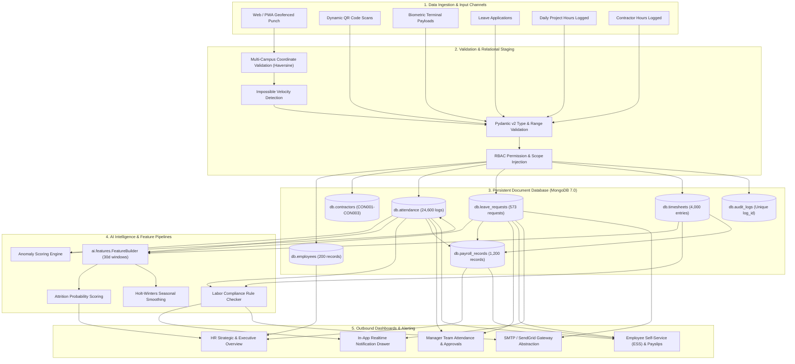

# DATA FLOW ARCHITECTURE DIAGRAM

**System:** AI-Powered Workforce Management Automation System (InnovateCorp HRvantage)  
**Document:** `docs/diagrams/data_flow.md`  

---

```mermaid
flowchart TD
    subgraph Ingestion ["1. Data Ingestion & Input Channels"]
        WebPunches["Web / PWA Geofenced Punch"]
        QRPunches["Dynamic QR Code Scans"]
        BiometricPunches["Biometric Terminal Payloads"]
        LeaveInputs["Leave Applications"]
        TimesheetLogs["Daily Project Hours Logged"]
        VendorTimesheets["Contractor Hours Logged"]
    end

    subgraph Validation_Staging ["2. Validation & Relational Staging"]
        GeofenceCheck["Multi-Campus Coordinate Validation (Haversine)"]
        VelocityCheck["Impossible Velocity Detection"]
        SchemaValidator["Pydantic v2 Type & Range Validation"]
        AuthContext["RBAC Permission & Scope Injection"]
    end

    subgraph Core_Storage ["3. Persistent Document Database (MongoDB 7.0)"]
        CollEmployees[("db.employees (200 records)")]
        CollContractors[("db.contractors (CON001-CON003)")]
        CollAttendance[("db.attendance (24,600 logs)")]
        CollLeave[("db.leave_requests (573 requests)")]
        CollTimesheets[("db.timesheets (4,000 entries)")]
        CollPayroll[("db.payroll_records (1,200 records)")]
        CollAudit[("db.audit_logs (Unique log_id)")]
    end

    subgraph Analytical_Pipelining ["4. AI Intelligence & Feature Pipelines"]
        FeatureBuilder["ai.features.FeatureBuilder (30d windows)"]
        IsolationForest["Anomaly Scoring Engine"]
        AttritionClassifier["Attrition Probability Scoring"]
        ForecastingEngine["Holt-Winters Seasonal Smoothing"]
        ComplianceScanner["Labor Compliance Rule Checker"]
    end

    subgraph Presentation_Out ["5. Outbound Dashboards & Alerting"]
        HRAnalytics["HR Strategic & Executive Overview"]
        ManagerView["Manager Team Attendance & Approvals"]
        EmployeePortal["Employee Self-Service (ESS) & Payslips"]
        InAppAlerts["In-App Realtime Notification Drawer"]
        EmailGateway["SMTP / SendGrid Gateway Abstraction"]
    end

    WebPunches --> GeofenceCheck --> VelocityCheck --> SchemaValidator
    QRPunches --> SchemaValidator
    BiometricPunches --> SchemaValidator
    LeaveInputs --> SchemaValidator
    TimesheetLogs --> SchemaValidator
    VendorTimesheets --> SchemaValidator

    SchemaValidator --> AuthContext
    AuthContext --> CollEmployees
    AuthContext --> CollContractors
    AuthContext --> CollAttendance
    AuthContext --> CollLeave
    AuthContext --> CollTimesheets
    AuthContext --> CollAudit

    CollAttendance --> IsolationForest --> CollAttendance
    CollAttendance & CollLeave & CollTimesheets --> FeatureBuilder
    FeatureBuilder --> AttritionClassifier
    FeatureBuilder --> ForecastingEngine
    CollAttendance & CollTimesheets --> ComplianceScanner

    CollAttendance & CollLeave & CollTimesheets --> CollPayroll

    CollEmployees & CollPayroll & AttritionClassifier --> HRAnalytics
    CollAttendance & CollLeave --> ManagerView
    CollAttendance & CollLeave & CollPayroll --> EmployeePortal
    ComplianceScanner & CollLeave --> InAppAlerts & EmailGateway
```
