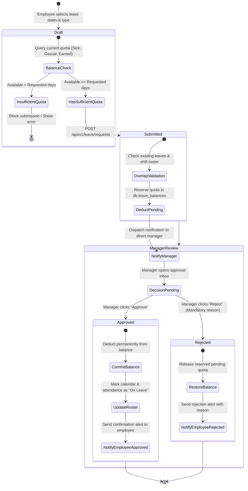

# LEAVE WORKFLOW & APPROVAL CYCLE DIAGRAM

**System:** AI-Powered Workforce Management Automation System (InnovateCorp HRvantage)  
**Document:** `docs/diagrams/leave_workflow.md`  

---

```mermaid
stateDiagram-v2
    [*] --> Draft: Employee selects leave dates & type

    state Draft {
        [*] --> BalanceCheck: Query current quota (Sick, Casual, Earned)
        BalanceCheck --> HasSufficientQuota: Available >= Requested days
        BalanceCheck --> InsufficientQuota: Available < Requested days
        InsufficientQuota --> [*]: Block submission / Show error
    }

    HasSufficientQuota --> Submitted: POST /api/v1/leave/requests

    state Submitted {
        [*] --> OverlapValidation: Check existing leaves & shift roster
        OverlapValidation --> DeductPending: Reserve quota in db.leave_balances
        DeductPending --> NotifyManager: Dispatch notification to direct manager
    }

    state ManagerReview {
        NotifyManager --> DecisionPending: Manager opens approval inbox
        DecisionPending --> Approved: Manager clicks "Approve"
        DecisionPending --> Rejected: Manager clicks "Reject" (Mandatory reason)
    }

    Submitted --> ManagerReview

    state Approved {
        [*] --> CommitBalance: Deduct permanently from balance
        CommitBalance --> UpdateRoster: Mark calendar & attendance as "On Leave"
        UpdateRoster --> NotifyEmployeeApproved: Send confirmation alert to employee
    }

    state Rejected {
        [*] --> RestoreBalance: Release reserved pending quota
        RestoreBalance --> NotifyEmployeeRejected: Send rejection alert with reason
    }

    Approved --> [*]
    Rejected --> [*]
```
