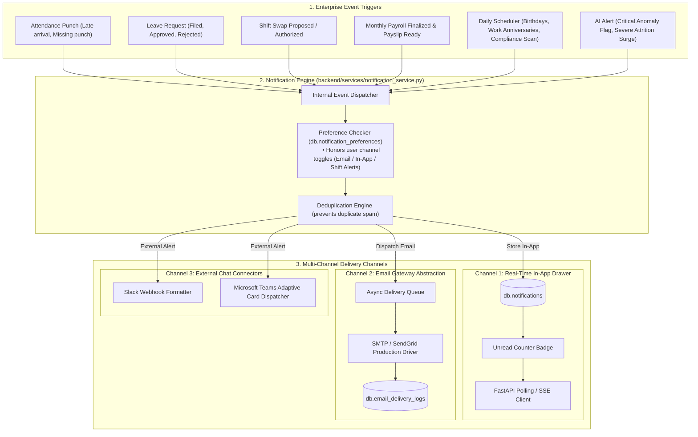

# NOTIFICATION & WORKFLOW AUTOMATION ARCHITECTURE DIAGRAM

**System:** AI-Powered Workforce Management Automation System (InnovateCorp HRvantage)  
**Document:** `docs/diagrams/notification_architecture.md`  

---

