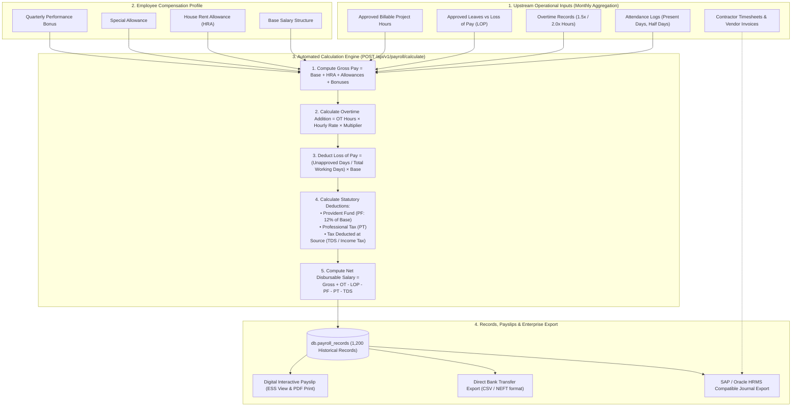

# PAYROLL CALCULATION & DISBURSEMENT FLOW DIAGRAM

**System:** AI-Powered Workforce Management Automation System (InnovateCorp HRvantage)  
**Document:** `docs/diagrams/payroll_flow.md`  

---

```mermaid
flowchart TD
    subgraph Operational_Inputs ["1. Upstream Operational Inputs (Monthly Aggregation)"]
        AttData["Attendance Logs (Present Days, Half Days)"]
        OTData["Overtime Records (1.5x / 2.0x Hours)"]
        LeaveData["Approved Leaves vs Loss of Pay (LOP)"]
        TimesheetData["Approved Billable Project Hours"]
        ContractorData["Contractor Timesheets & Vendor Invoices"]
    end

    subgraph Compensation_Structure ["2. Employee Compensation Profile"]
        BaseSalary["Base Salary Structure"]
        HRA["House Rent Allowance (HRA)"]
        SpecialAllowance["Special Allowance"]
        PerformanceBonus["Quarterly Performance Bonus"]
    end

    subgraph Payroll_Engine ["3. Automated Calculation Engine (POST /api/v1/payroll/calculate)"]
        ComputeGross["1. Compute Gross Pay = Base + HRA + Allowances + Bonuses"]
        ComputeOT["2. Calculate Overtime Addition = OT Hours × Hourly Rate × Multiplier"]
        ComputeLOP["3. Deduct Loss of Pay = (Unapproved Days / Total Working Days) × Base"]
        ComputeStatutory["4. Calculate Statutory Deductions:
        • Provident Fund (PF: 12% of Base)
        • Professional Tax (PT)
        • Tax Deducted at Source (TDS / Income Tax)"]
        ComputeNet["5. Compute Net Disbursable Salary =
        Gross + OT - LOP - PF - PT - TDS"]
    end

    subgraph Financial_Artifacts ["4. Records, Payslips & Enterprise Export"]
        DBPayroll[("db.payroll_records (1,200 Historical Records)")]
        DigitalPayslip["Digital Interactive Payslip (ESS View & PDF Print)"]
        BankCSV["Direct Bank Transfer Export (CSV / NEFT format)"]
        ERPExport["SAP / Oracle HRMS Compatible Journal Export"]
    end

    AttData & OTData & LeaveData & TimesheetData --> ComputeGross
    BaseSalary & HRA & SpecialAllowance & PerformanceBonus --> ComputeGross

    ComputeGross --> ComputeOT --> ComputeLOP --> ComputeStatutory --> ComputeNet
    ContractorData -.-> ERPExport

    ComputeNet --> DBPayroll
    DBPayroll --> DigitalPayslip
    DBPayroll --> BankCSV
    DBPayroll --> ERPExport
```
