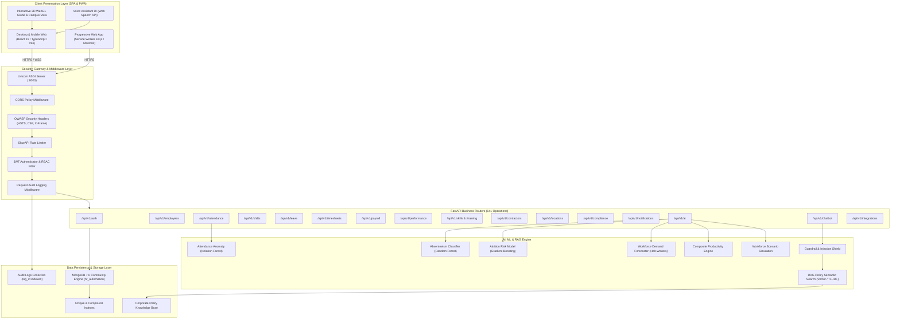

# SYSTEM ARCHITECTURE DIAGRAM

**System:** AI-Powered Workforce Management Automation System (InnovateCorp HRvantage)  
**Document:** `docs/diagrams/system_architecture.md`  

---

```mermaid
graph TB
    subgraph Client_Layer ["Client Presentation Layer (SPA & PWA)"]
        Browser["Desktop & Mobile Web (React 19 / TypeScript / Vite)"]
        PWA["Progressive Web App (Service Worker sw.js / Manifest)"]
        ThreeD["Interactive 3D WebGL Globe & Campus View"]
        VoiceIO["Voice Assistant UI (Web Speech API)"]
    end

    subgraph Gateway_Security ["Security, Gateway & Middleware Layer"]
        ASGI["Uvicorn ASGI Server (:8000)"]
        CORS["CORS Policy Middleware"]
        OWASP["OWASP Security Headers (HSTS, CSP, X-Frame)"]
        RateLimit["SlowAPI Rate Limiter"]
        AuthGate["JWT Authenticator & RBAC Filter"]
        AuditLog["Request Audit Logging Middleware"]
    end

    subgraph Service_Routers ["FastAPI Business Routers (141 Operations)"]
        AuthRouter["/api/v1/auth"]
        EmpRouter["/api/v1/employees"]
        AttRouter["/api/v1/attendance"]
        ShiftRouter["/api/v1/shifts"]
        LeaveRouter["/api/v1/leave"]
        TimeRouter["/api/v1/timesheets"]
        PayRouter["/api/v1/payroll"]
        PerfRouter["/api/v1/performance"]
        SkillsRouter["/api/v1/skills & /training"]
        ContractRouter["/api/v1/contractors"]
        LocationRouter["/api/v1/locations"]
        CompRouter["/api/v1/compliance"]
        NotifyRouter["/api/v1/notifications"]
        AIRouter["/api/v1/ai"]
        ChatRouter["/api/v1/chatbot"]
        IntegRouter["/api/v1/integrations"]
    end

    subgraph Intelligence_Layer ["AI, ML & RAG Engine"]
        AbsenteeismModel["Absenteeism Classifier (Random Forest)"]
        AttritionModel["Attrition Risk Model (Gradient Boosting)"]
        AnomalyModel["Attendance Anomaly (Isolation Forest)"]
        ForecasterModel["Workforce Demand Forecaster (Holt-Winters)"]
        ProductivityCalc["Composite Productivity Engine"]
        SimulationEngine["Workforce Scenario Simulation"]
        RAGRetriever["RAG Policy Semantic Search (Vector / TF-IDF)"]
        Guardrails["Guardrail & Injection Shield"]
    end

    subgraph Persistence_Layer ["Data Persistence & Storage Layer"]
        Mongo["MongoDB 7.0 Community Engine (hr_automation)"]
        MongoIndexes["Unique & Compound Indexes"]
        AuditTrail["Audit Logs Collection (log_id indexed)"]
        PolicyDocs["Corporate Policy Knowledge Base"]
    end

    Browser -->|HTTPS / WSS| ASGI
    PWA -->|HTTPS| ASGI
    ThreeD --> Browser
    VoiceIO --> Browser

    ASGI --> CORS --> OWASP --> RateLimit --> AuthGate --> AuditLog
    AuditLog --> Service_Routers

    AttRouter --> AnomalyModel
    AIRouter --> AbsenteeismModel
    AIRouter --> AttritionModel
    AIRouter --> ForecasterModel
    AIRouter --> ProductivityCalc
    AIRouter --> SimulationEngine
    ChatRouter --> Guardrails --> RAGRetriever

    Service_Routers --> Mongo
    Mongo --> MongoIndexes
    AuditLog --> AuditTrail
    RAGRetriever --> PolicyDocs
```
