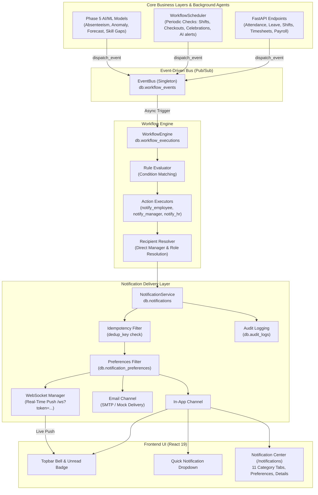

# Phase 7 — Real-Time Notifications & Automated HR Workflows

## 1. Executive Summary

Phase 7 introduces an event-driven automation and multi-channel notification layer to the **AI-Powered Workforce Management Automation System**. It transforms the platform from a reactive HR data management system into an intelligent, proactive workforce orchestrator.

The architecture decouples core HR business transactions (attendance clock-ins, leave requests, shift swaps, timesheets, payroll generation) from workflow actions. When business events occur or when periodic background checks detect anomalies or pending obligations, the system automatically evaluates rule conditions, resolves authorized recipients according to organizational reporting hierarchy, checks user preferences (with mandatory compliance notifications locked), ensures idempotency, and delivers real-time notifications via in-app feeds, WebSockets, and safe email abstractions.

---

## 2. System Architecture



---

## 3. Event-Driven Architecture (`backend/events/`)

### 3.1 Event Bus (`event_bus.py`)
- **Pattern:** Publisher-Subscriber with in-memory routing and persistent MongoDB auditing.
- **Persistence:** Every event published via `EventBus.publish()` is recorded into the `workflow_events` collection with an auto-generated `event_id`, timestamp, and full payload metadata.
- **Asynchronous Execution:** Handlers are invoked via `asyncio.gather(*tasks, return_exceptions=True)` ensuring that a failure in one handler cannot block other subscribers or crash the calling transaction.

### 3.2 Standardized Event Model (`HREvent`)
Implemented with Pydantic (`use_enum_values=True`):
- `event_id` (str, UUID4)
- `event_type` (`HREventType` enum)
- `actor_id` (Optional[str], User or Employee ID initiating action)
- `entity_type` (str, e.g. "attendance", "leave", "shift", "ai_model")
- `entity_id` (str, e.g. record ID)
- `payload` (Dict[str, Any], event context such as employee names, hours, metrics)
- `timestamp` (datetime, UTC)

### 3.3 Complete Event Types (`HREventType`)

| Category | Event Identifier | Description |
|---|---|---|
| **Attendance** | `ATTENDANCE_CHECK_IN` | Employee clocks in |
| | `ATTENDANCE_CHECK_OUT` | Employee clocks out |
| | `LATE_ARRIVAL` | Clock-in exceeds shift start + grace period |
| | `MISSING_CHECK_OUT` | Shift completed but no checkout recorded |
| | `ATTENDANCE_ANOMALY` | Suspicious duration, clock-in time, or GPS mismatch |
| **Leave** | `LEAVE_REQUEST_CREATED` | New leave application submitted |
| | `LEAVE_APPROVED` | Leave formally approved by manager/HR |
| | `LEAVE_REJECTED` | Leave rejected with optional reason |
| | `LEAVE_CANCELLED` | Leave request retracted |
| **Shifts** | `SHIFT_ASSIGNED` | Employee assigned to a roster slot |
| | `SHIFT_CHANGED` | Timings, date, or department adjusted |
| | `SHIFT_REMINDER` | Upcoming shift alert (configurable minutes) |
| | `SHIFT_SWAP_REQUESTED` | Peer shift swap requested |
| | `SHIFT_SWAP_APPROVED` | Shift swap approved by management |
| | `SHIFT_SWAP_REJECTED` | Shift swap rejected |
| **Overtime** | `OVERTIME_DETECTED` | Hours worked exceed scheduled shift + threshold |
| **Timesheets** | `TIMESHEET_SUBMITTED` | Timesheet finalized for review |
| | `TIMESHEET_APPROVED` | Timesheet approved for payroll billing |
| | `TIMESHEET_REJECTED` | Timesheet sent back for rework |
| | `TIMESHEET_REMINDER` | Unsubmitted timesheet alert |
| **Payroll** | `PAYROLL_READY` | Draft payroll calculated |
| | `PAYROLL_PROCESSED` | Batch payroll approved and processed |
| | `PAYSLIP_AVAILABLE` | Individual digital payslip published |
| **Performance** | `PERFORMANCE_REVIEW_DUE` | Performance review cycle deadline near |
| | `GOAL_DEADLINE` | OKR/KPI milestone due soon |
| | `PERFORMANCE_REVIEW_COMPLETED` | Appraisal score approved |
| **Training** | `TRAINING_ASSIGNED` | Mandatory or elective course assigned |
| | `TRAINING_DEADLINE` | Training completion deadline approaching |
| | `TRAINING_COMPLETED` | Certificate generated |
| **Celebrations** | `BIRTHDAY_REMINDER` | Employee birthday celebration |
| | `WORK_ANNIVERSARY` | Tenure service milestone |
| **AI Alerts** | `AI_ATTENDANCE_ANOMALY` | ML anomaly detection on attendance patterns |
| | `AI_ABSENTEEISM_ALERT` | Predictive model flags high absenteeism risk |
| | `AI_ATTRITION_ALERT` | Predictive model flags employee flight risk |
| | `AI_WORKFORCE_FORECAST_ALERT` | Staffing demand vs capacity shortfall |
| | `AI_SKILL_GAP_ALERT` | Department skill deficit flagged |
| **Compliance** | `COMPLIANCE_ALERT` | Regulatory audit, visa, safety, or labor law reminder |

---

## 4. Workflow Engine (`backend/workflows/`)

### 4.1 Architecture
The `WorkflowEngine` acts as an autonomous subscriber to the `EventBus`. When an `HREvent` arrives:
1. It queries active `WorkflowRule` configurations matching `event_type`.
2. Evaluates JSON-based condition trees (supporting `$eq`, `$ne`, `$gt`, `$gte`, `$lt`, `$lte`, `$in`, `$contains`).
3. Executes bound action handlers:
   - `action_notify_employee`: Resolves the primary subject of the event.
   - `action_notify_manager`: Traverses the MongoDB `employees` collection to resolve the subject's reporting manager (`manager_id`).
   - `action_notify_hr`: Resolves all users with `hr_admin` or `admin` roles.
4. Records execution status, duration, and action results into the `workflow_executions` collection.

### 4.2 Configurable Default Rules
- `WF-RULE-001` (Late Arrival): Triggers employee alert + manager alert if `late_minutes >= 15`.
- `WF-RULE-002` (Leave Submitted): Triggers direct manager alert with action link to `/leave`.
- `WF-RULE-003` (Leave Approved): Triggers employee celebration alert with updated balance reminder.
- `WF-RULE-004` (Leave Rejected): Triggers employee notification with rejection remarks.
- `WF-RULE-005` (Missing Checkout): Triggers employee reminder to regularize hours.
- `WF-RULE-006` (Overtime Alert): Triggers employee & manager alert when `overtime_hours >= 2.0`.
- `WF-RULE-007` (Payslip Available): Triggers employee notification with link to `/payroll`.
- `WF-RULE-008` (Shift Reminder): Triggers employee upcoming shift notification.
- `WF-RULE-009` (AI Absenteeism): Triggers HR alert when `absenteeism_risk >= 0.70`.
- `WF-RULE-010` (AI Skill Gap): Triggers HR/Manager alert with link to `/workforce-intelligence`.
- `WF-RULE-011` (Birthday): Triggers employee and team celebration notification.
- `WF-RULE-012` (Work Anniversary): Triggers milestone celebration notification.
- `WF-RULE-013` (Compliance): Triggers critical priority HR alert.

---

## 5. Notification Service & Delivery Channels (`backend/notifications/`)

### 5.1 Channels
1. **In-App Channel (`InAppChannel`):**
   - Writes directly to MongoDB `notifications` collection with rich metadata.
   - Unread badges and instant listing on topbar and notification center.
2. **WebSocket Real-Time Channel (`ws_manager`):**
   - Active clients connect to `ws://localhost:8000/api/v1/notifications/ws?token=<JWT_TOKEN>`.
   - On in-app notification creation, `ws_manager.send_to_user()` broadcasts the notification object directly to the active browser session.
   - Frontend gracefully reconnects on network drop or falls back to polling.
3. **Email Channel (`EmailChannel`):**
   - Decoupled SMTP abstraction with TLS support (`smtplib`).
   - Controlled via `EMAIL_ENABLED=true/false` in `.env`.
   - When disabled or during automated testing, seamlessly logs delivery to stdout/audit without sending external requests or throwing exceptions.

### 5.2 Idempotency and Duplicate Prevention
Every notification is protected by a deterministic `dedup_key` calculated as:
```text
dedup_key = f"{rule_id or event_type}_{recipient_id}_{entity_id or date_key}"
```
Before inserting, `NotificationService` performs an atomic uniqueness check. If a notification with the same `dedup_key` exists within its active window, the duplicate dispatch is safely skipped and logged.

### 5.3 Notification Preferences & Mandatory Compliance
Users can toggle notifications per functional domain (`attendance`, `leave`, `shifts`, `timesheets`, `payroll`, `performance`, `training`, `birthdays`, `ai_alerts`, `email_enabled`, `in_app_enabled`).
**Security & Governance Guardrail:**
- `compliance_notifications` is **locked to `true`**.
- Any attempt to disable compliance notifications via `PUT /api/v1/notifications/preferences` is strictly overridden by the backend service.
- The React UI displays this toggle in a disabled, locked state with a tooltip informing users of statutory compliance policy.

### 5.4 AI Governance & Safety Labeling
All AI-generated notifications (`AI_ATTENDANCE_ANOMALY`, `AI_ABSENTEEISM_ALERT`, `AI_ATTRITION_ALERT`, `AI_WORKFORCE_FORECAST_ALERT`, `AI_SKILL_GAP_ALERT`) strictly adhere to human-in-the-loop ethical guidelines:
- Clearly designated with `[AI Insight]` prefixes.
- Never presented as definitive facts; phrased as probabilistic risk models.
- Accompanied by the mandatory governance footer:
  > *"🤖 AI-generated workforce insight based on predictive modeling. For managerial decision support only. Human review is required before taking administrative action."*

---

## 6. Background Scheduled Jobs (`WorkflowScheduler`)

Implemented using non-blocking asynchronous asyncio tasks running on a configurable interval (`SCHEDULER_INTERVAL_SECONDS=300`).
The scheduler runs 8 background sweeps:
1. **Shift Reminders (`check_shift_reminders`):** Checks upcoming shifts starting in `< SHIFT_REMINDER_MINUTES` and sends reminders.
2. **Missing Checkouts (`check_missing_checkouts`):** Detects clock-ins with no check-out past the scheduled shift end.
3. **Timesheet Reminders (`check_timesheet_reminders`):** Identifies missing timesheet submissions prior to billing cycles.
4. **Performance Reviews (`check_performance_reminders`):** Scans reviews due within `PERFORMANCE_REMINDER_DAYS`.
5. **Training Deadlines (`check_training_reminders`):** Scans active courses due within `TRAINING_REMINDER_DAYS`.
6. **Birthdays & Anniversaries (`check_celebrations`):** Daily sweep matching employee birth dates and hiring dates.
7. **AI Alert Sweep (`check_ai_alerts`):** Consumes Phase 5 predictive model outputs and triggers alerts for elevated risk indices.
8. **Compliance Sweep (`check_compliance`):** Scans pending certifications and compliance audits.

*Note on Local Development vs Multi-Worker Deployments:*
In single-instance development/staging, the scheduler runs directly within the FastAPI lifecycle. In multi-worker production (e.g. Gunicorn/Uvicorn multi-process), a distributed lock (e.g., Redis `SETNX` or MongoDB leader election) should be enabled to prevent duplicate cron runs across workers.

---

## 7. REST API Catalog

All endpoints require JWT Bearer authentication and validate user role permissions.

### 7.1 Notifications API (`/api/v1/notifications`)
- `GET /api/v1/notifications`: Paginated list of notifications with filters (`category`, `priority`, `is_read`, `limit`, `skip`).
- `GET /api/v1/notifications/unread-count`: Returns `{ "unread_count": <int> }`.
- `GET /api/v1/notifications/{notification_id}`: Retrieves single notification details.
- `PATCH /api/v1/notifications/{notification_id}/read`: Marks notification as read.
- `PATCH /api/v1/notifications/read-all`: Marks all notifications for current user as read.
- `GET /api/v1/notifications/preferences`: Retrieves current user's notification preferences.
- `PUT /api/v1/notifications/preferences`: Updates user preferences (compliance locked).
- `WebSocket /api/v1/notifications/ws?token=<JWT>`: Authenticated real-time streaming channel.

### 7.2 Workflows Monitoring API (`/api/v1/workflows`)
- `GET /api/v1/workflows`: Returns all configured workflow rules (Admin/HR only).
- `GET /api/v1/workflows/events`: Audit stream of recent published HR events (Admin/HR only).
- `GET /api/v1/workflows/status`: Status of the workflow engine and background scheduler.
- `POST /api/v1/workflows/run-scheduled`: On-demand manual trigger for background scheduled checks (Admin/HR only).

---

## 8. Frontend Implementation (`frontend/src/`)

1. **Topbar Notification Bell (`layouts/Topbar.tsx`):**
   - Displays real-time unread badge count.
   - Connection status pill indicates `"Real-Time"` (WebSocket connected) or `"System Live"` (polling fallback).
   - Quick dropdown list of the latest 5 unread alerts with direct action links and one-click "Mark all as read".
2. **Dedicated Notification Center (`pages/notifications/NotificationsPage.tsx`):**
   - Route: `/notifications`.
   - 11 Filter Tabs: **All**, **Unread**, **Attendance**, **Leave**, **Shifts**, **Payroll**, **Performance**, **Training**, **AI Alerts**, **Compliance**, and **Preferences**.
   - Search bar and category filtering.
   - Interactive Detail Modal with AI Governance disclosures.
   - Integrated Preferences Panel allowing employees to customize their delivery channels and categories.

---

## 9. Verification & Test Suite

The implementation has been thoroughly verified across all phases:
- **Backend Test Suite:** 58/58 tests passing (`pytest tests/`).
  - Unit tests for EventBus, Rule Evaluator, Recipient Resolution.
  - Functional tests for NotificationService, Idempotency, and Preference enforcement.
  - End-to-end workflow tests for Attendance, Leave lifecycle, Overtime, AI alerts, and WebSockets.
- **Database Validation:** 28/28 checks passing (`database/validate_database.py`).
- **Frontend Test Suite:** 22/22 unit & integration tests passing (`npm test`).
- **Frontend Lint & Build:** 0 ESLint errors, clean production bundle compiled via Vite (`npm run build`).

---

## 10. Configuration & Environment Variables

| Variable | Default | Purpose |
|---|---|---|
| `NOTIFICATIONS_ENABLED` | `true` | Master switch for workflow notifications |
| `REALTIME_NOTIFICATIONS_ENABLED` | `true` | Enables WebSocket server and client |
| `NOTIFICATION_POLL_INTERVAL_SECONDS` | `30` | Fallback polling interval for UI |
| `SCHEDULER_INTERVAL_SECONDS` | `300` | Background scheduler cycle (seconds) |
| `EMAIL_ENABLED` | `false` | Enable/disable real SMTP outbound dispatch |
| `EMAIL_PROVIDER` | `smtp` | Mail provider (`smtp`, `sendgrid`, `mock`) |
| `SMTP_HOST` | `smtp.mailgun.org` | SMTP server address |
| `SMTP_PORT` | `587` | SMTP server port |
| `SMTP_USERNAME` | `""` | SMTP authentication user |
| `SMTP_PASSWORD` | `""` | SMTP authentication password |
| `EMAIL_FROM` | `notifications@workforce.ai` | Outbound email address |
| `SHIFT_REMINDER_MINUTES` | `60` | Upcoming shift alert window |
| `OVERTIME_ALERT_THRESHOLD_HOURS` | `2` | Overtime alert threshold |
| `PERFORMANCE_REMINDER_DAYS` | `7` | Review deadline warning window |
| `TRAINING_REMINDER_DAYS` | `3` | Training deadline warning window |
