# Phase 8 — 3D Enterprise UI Transformation

## 1. Executive Summary

Phase 8 elevates the **AI-Powered Workforce Management Automation System** from a 2D interface into a **modern, interactive 3D enterprise workforce intelligence platform**. 

The transformation introduces hardware-accelerated WebGL spatial visualizations using **Three.js**, **React Three Fiber (@react-three/fiber)**, **@react-three/drei**, and **Framer Motion**, strictly guided by the core design principle: **Selective 3D Enhancement**. Operational interfaces (forms, data grids, tables, numerical inputs, settings) remain precise, clean, and accessible, while executive overviews, workforce topology, attendance distribution, shift allocation, and AI neural core representations leverage interactive 3D spatial depth.

---

## 2. 3D Architecture & Component Ecosystem

```mermaid
graph TD
    subgraph "Application Presentation Shell"
        TL["Theme System<br/>(Dark / Light + Reduced Motion)"]
        TB["Topbar<br/>(Theme Toggle, AI Launch, 3D Notification Bell)"]
        SB["Sidebar<br/>(Glow Indicators, Settings, RBAC)"]
        FAB["Floating 3D AI Assistant<br/>(Interactive Holographic Orb & RAG)"]
    end

    subgraph "3D Component Engine (frontend/src/components/3d/)"
        SC["SceneCanvas<br/>(WebGL Detection, ErrorBoundary, Suspense)"]
        WFB["WebGLFallback<br/>(Graceful 2D CSS-Depth Fallback)"]
        TDH["ThreeDHero<br/>(Workforce Constellation Scene)"]
        TDM["ThreeDMetricCard<br/>(Interactive Perspective Tilt Cards)"]
        WFS["WorkforceScene<br/>(Department Spatial Clusters & Employee Nodes)"]
        ATS["AttendanceScene<br/>(Circular Activity Model & Radar Pillars)"]
        SCS["ShiftCapacityScene<br/>(Fluid Glass Podiums & Roster Capacity)"]
        AIC["AIIntelligenceCore<br/>(Neural Core & Predictive Module Conduits)"]
        ORB["AIAssistantOrb<br/>(Pulsing Holographic AI Avatar)"]
    end

    subgraph "Pages & Modules Transformed"
        HRD["HR Dashboard"]
        MGD["Manager Dashboard"]
        EMD["Employee Dashboard"]
        ATP["Attendance Tracking (/attendance)"]
        SHP["Shifts & Rostering (/shifts)"]
        AIP["AI Workforce Intelligence (/ai-intelligence)"]
        CHP["AI Assistant & RAG Chatbot (/ai-assistant)"]
    end

    SC --> WFB
    SC --> TDH
    SC --> WFS
    SC --> ATS
    SC --> SCS
    SC --> AIC
    SC --> ORB

    TDH --> HRD
    TDM --> HRD
    WFS --> HRD
    TDM --> MGD
    WFS --> MGD
    TDM --> EMD
    ATS --> ATP
    SCS --> SHP
    AIC --> AIP
    ORB --> CHP
    FAB --> HRD
```



---

## 3. Technology Stack & Dependencies Added

The following packages were integrated into `frontend/package.json`:
* `three` (`^0.183.0`): Core WebGL 3D rendering engine.
* `@types/three` (`^0.183.1`): Type definitions for Three.js.
* `@react-three/fiber` (`^9.5.0`): React 19 reconciler for Three.js.
* `@react-three/drei` (`^10.7.7`): Helper abstractions (Html, Float, Line, OrbitControls).
* `framer-motion` (`^12.39.0`): Physics-based spring animations and interactive mouse tilt transforms.

---

## 4. Key 3D Features & Spatial Scenes

### 4.1 Flagship 3D Hero Constellation (`ThreeDHero.tsx`)
- **Visual Concept:** Interactive organizational constellation featuring floating department clusters (Engineering, Operations, Sales & Marketing, HR, Finance, Compliance) orbiting a central workforce AI nucleus.
- **Interactivity:** Reacts subtly to cursor position with smooth parallax lerp interpolation. Clicking any node displays the department name, personnel headcount, and active allocation.
- **Overlay:** High-level executive statistics (200 Headcount, 6 Units, 192 Active Personnel) with real backend data.

### 4.2 Elevated 3D KPI Cards (`ThreeDMetricCard.tsx`)
- **Visual Depth:** Layered 3D cards with dynamic perspective tilt tracked by Framer Motion mouse transforms.
- **Accents:** Neon/glass accent bars, radial sheen overlays on hover, and embedded 3D depth tags (`translateZ(25px)`).

### 4.3 Interactive Workforce Topology Mesh (`WorkforceScene.tsx`)
- **Clustering:** Groups employees around department 3D centroids in a golden-ratio spiral distribution.
- **Inspector HUD:** Hovering or clicking an employee node brings up an interactive side HUD inspector displaying Employee ID, Name, Department, Employment Status, Location, and Corporate Email.
- **Filtering:** Department filter chips allow instant focusing on specific business units.

### 4.4 3D Circular Attendance Activity Radar (`AttendanceScene.tsx`)
- **Spatial Model:** Concentric radar rings with 5 spatial activity pillars:
  - North: **Present** (Emerald Green)
  - West: **Late Arrival** (Amber Gold)
  - East: **Absent** (Rose Red)
  - South-West: **On Leave** (Purple)
  - South-East: **Half Day** (Cyan Blue)
- **Interactive Filtering:** Clicking any status pillar automatically filters the attendance records table in `AttendancePage.tsx`.

### 4.5 3D Shift Allocation Podiums (`ShiftCapacityScene.tsx`)
- **Spatial Podiums:** 4 physical glass columns for Morning, Afternoon, Night, and Rotational shifts.
- **Utilization Visualizer:** Inner colored fluid fills indicate real roster capacity utilization ($Assigned / Capacity$).

### 4.6 AI Intelligence Neural Core (`AIIntelligenceCore.tsx`)
- **Central Core:** Rotating 3D icosahedron with concentric gyroscopic rings.
- **Data Conduits:** Dynamic connecting filaments linking to all 6 Phase 5 predictive models:
  - Absenteeism Prediction (RandomForest)
  - Attrition Flight Risk (Logistic Regression)
  - Attendance Anomaly Detection (Isolation Forest)
  - Workforce Forecaster (Polynomial Trend Projection)
  - Skill Gap & Training Optimizer
  - Productivity Engine
- **Pipeline Communicator:** Visualizes `HR Data Streams → AI Analysis → Workforce Intelligence → Automated Workflows`.

### 4.7 Holographic 3D AI Assistant Avatar (`AIAssistantOrb.tsx`)
- **Orb Geometry:** Pulsating central holographic core with dual counter-rotating orbital rings and particle shell.
- **Responsive States:** When thinking or executing RAG queries, the orb shifts into a high-speed wireframe with wave excitation.
- **Global Availability:** Accessible on every page via the persistent floating button (`FloatingAIAssistant.tsx`) and inside `/ai-assistant`.

---

## 5. UI Design System & Theme Engine

### 5.1 Dark & Light Mode (`ThemeContext.tsx`)
* **Enterprise Dark (Default):** Deep space navy (`#0B0F19`), translucent card glass (`rgba(22, 30, 49, 0.75)`), and crisp indigo accents (`#6366F1`).
* **Enterprise Light:** Pristine slate (`#F8FAFC`), crisp white glass cards (`rgba(255, 255, 255, 0.85)`), and slate-900 typography (`#0F172A`).
* **Theme Switcher:** Single-click toggle in Topbar, automatically persisted in `localStorage`.

### 5.2 Accessibility & Reduced Motion
* Full support for `prefers-reduced-motion: reduce`.
* When detected or toggled, automatic 3D rotations, floating loops, and tilt transforms are immediately halted.
* Color contrast adheres to WCAG AA enterprise readability standards.

### 5.3 WebGL Fallback Strategy (`WebGLFallback.tsx`)
* Every 3D canvas is wrapped inside `SceneCanvas` with hardware capability detection (`window.WebGLRenderingContext`).
* If WebGL is disabled, unsupported, or fails to initialize, a CSS-depth 2D card with radial gradient lines and clean numerical summaries is rendered seamlessly with zero application crashes.

---

## 6. How to Run & Verify

### Frontend Dev Server
```powershell
cd frontend
npm run dev
```

### Frontend Tests (Vitest)
```powershell
cd frontend
npm test -- --run
```
*Result: 7 test files passed, 25 / 25 tests passed (100%).*

### Frontend Production Build
```powershell
cd frontend
npm run build
```

---

## 7. Troubleshooting 3D Rendering

| Symptom | Cause | Solution |
|---|---|---|
| Black or blank canvas | Hardware acceleration disabled in browser | Enable "Use hardware acceleration when available" in browser settings. |
| Fallback card displays instead of 3D | Headless/virtualized browser or WebGL disabled | The app automatically displays the 2D fallback; no action required. |
| High CPU/GPU usage on low-spec laptops | High pixel ratio (DPR) | `SceneCanvas` clamps DPR to `[1, 1.5]`, low polygon counts, and pauses animation on blur. |
| Canvas crashes on tab reload | WebGL Context Loss | `CanvasErrorBoundary` catches context loss and restores via fallback. |
